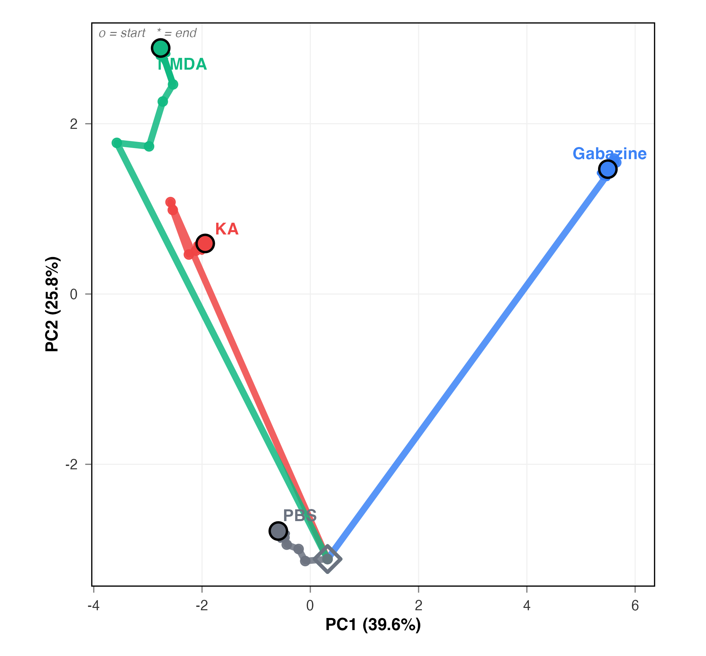
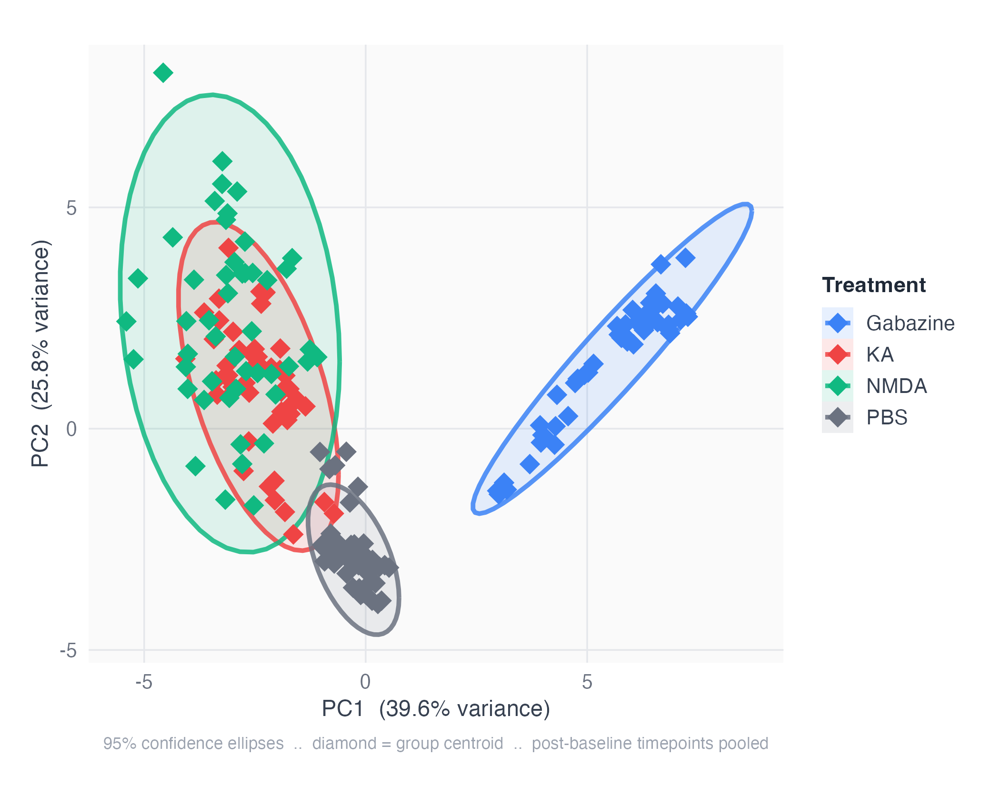
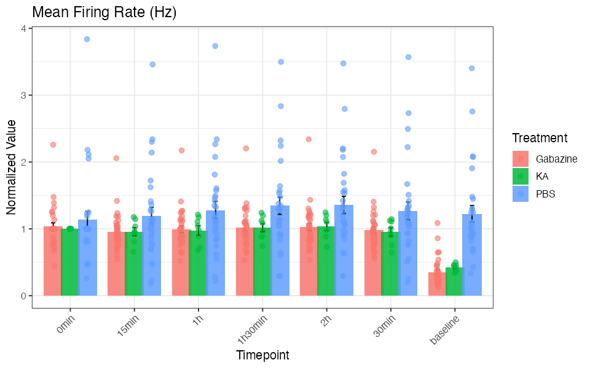

# NOVA
**Neural Output Visualization and Analysis**

[](https://www.gnu.org/licenses/gpl-3.0) [](https://cran.r-project.org/) [](https://lifecycle.r-lib.org/articles/stages.html#experimental)

A comprehensive R toolkit for analyzing and visualizing Multi-Electrode Array (MEA) neural data — from raw CSV discovery through PCA trajectory analysis, heatmap generation, and per-metric plotting — with publication-ready figures in a few lines of code.

---

## Key Features

- 🔍 **Smart data discovery** — automatically detects MEA folder structure and CSV metadata rows without manual configuration
- 🔥 **Raw-data heatmaps** — visualize un-normalized electrode activity directly alongside normalized views
- 📊 **Per-metric plotting** — bar, box, violin, or line plots for any single MEA variable with flexible faceting and filtering
- 🎯 **PCA trajectory analysis** — track how neural populations evolve over time with publication-ready trajectory and ellipse plots
- ⚡ **Zero-code quickstart** — one script (`Example/nova_quickstart.R`) to change a single path and generate all figures automatically
- 📖 **Full user guide** — illustrated HTML guide with step-by-step walkthroughs for every major function

<br>

<table align="center" width="100%" border="0" cellspacing="0" cellpadding="12">
<tr>
<td align="center" width="50%">
  
  <br><em>Treatment groups traced through PCA space over multiple timepoints.<br>Each group follows a distinct neural trajectory.</em>
</td>
<td align="center" width="50%">
  
  <br><em>95% CI ellipses reveal complete separation of network states<br>driven by each pharmacological treatment.</em>
</td>
</tr>
</table>

<br>

---

## Installation

```r
# Install from GitHub
remotes::install_github("atudoras/nova")

# Or using devtools
# install.packages("devtools")
devtools::install_github("atudoras/nova")

# Install from CRAN (coming soon)
install.packages("NOVA")
```

---

## Quick Start

```r
library(NOVA)

# Step 1: Discover your MEA data directory structure
discovery <- discover_mea_structure("path/to/your/MEA_data")

# Step 2: Process MEA data across timepoints and grouping variables
processed <- process_mea_flexible(
  main_dir       = "path/to/your/MEA_data",
  selected_timepoints  = c("baseline", "0min", "15min", "30min", "1h", "2h"),
  grouping_variables   = c("Experiment", "Treatment", "Well"),
  baseline_timepoint   = "baseline"
)

# Step 3: Run enhanced PCA
pca_results <- pca_analysis_enhanced(processing_result = processed)

# Step 4: Generate PCA plots (scatter, ellipses, loadings)
pca_plots <- pca_plots_enhanced(
  pca_output      = pca_results,
  color_variable  = "Treatment",
  shape_variable  = NULL
)

# Step 5: Plot PCA trajectories across timepoints
trajectories <- plot_pca_trajectories_general(
  pca_results,
  timepoint_order      = c("baseline", "0min", "15min", "30min", "1h", "2h"),
  trajectory_grouping  = c("Treatment")
)

# Step 6: Create MEA heatmaps (filter to specific treatments)
heatmaps <- create_mea_heatmaps_enhanced(
  processing_result   = processed,
  grouping_columns    = c("Treatment"),
  filter_treatments   = c("Vehicle", "Drug_A")
)

# Step 7: Plot a single metric across groups
plot_mea_metric(
  data       = processed$processed_data,
  metric     = "MeanFiringRate",
  plot_type  = "violin",
  facet_by   = "Timepoint"
)
```

<table align="center" width="100%" border="0" cellspacing="0" cellpadding="12">
<tr>
<td align="center" width="50%">
  
  <br><em>Clustered heatmap of all MEA metrics (Z-score) across treatment groups.</em>
</td>
<td align="center" width="50%">
  
  <br><em>Mean firing rate across timepoints, plotted per treatment with individual data points.</em>
</td>
</tr>
</table>

---

## What's New in v0.1.1

| Feature | Description |
|---|---|
| Smart CSV row detection | `find_mea_metadata_row()` scans for the "Treatment" label instead of assuming a fixed row number — handles Axion software export variations automatically |
| Raw-data heatmaps | New `use_raw = TRUE` parameter in `create_mea_heatmaps_enhanced()` renders un-normalized electrode data directly |
| Per-metric plots | New `plot_mea_metric()` function generates bar, box, violin, or line plots for any single MEA variable with full faceting and error bar control |
| Heatmap filter and split | New `filter_treatments` and `split_by` parameters in `create_mea_heatmaps_enhanced()` for focused, side-by-side comparisons |
| Zero-code quickstart script | `Example/nova_quickstart.R` — set `DATA_DIR` once, run the script, and all figures are saved automatically |
| Illustrated user guide | Full step-by-step HTML guide with figures available in `docs/user-guide/` |

---

## Function Reference

| Function | Description | Key Parameters |
|---|---|---|
| `discover_mea_structure` | Scans a directory and reports all detected MEA experiments and timepoints | `main_dir`, `verbose` |
| `process_mea_flexible` | Reads and merges CSVs across experiments and timepoints; normalizes to baseline | `main_dir`, `selected_timepoints`, `grouping_variables`, `baseline_timepoint` |
| `pca_analysis_enhanced` | Runs PCA on the processed feature matrix; returns scores, loadings, and variance explained | `processing_result`, `scale`, `center` |
| `pca_plots_enhanced` | Generates a suite of PCA visualizations (scatter, ellipses, loadings, variance) | `pca_output`, `color_variable`, `shape_variable` |
| `plot_pca_trajectories_general` | Draws mean PCA trajectories across timepoints for each experimental group | `pca_output`, `timepoint_order`, `trajectory_grouping` |
| `create_mea_heatmaps_enhanced` | Creates heatmaps of MEA metrics by treatment; supports raw or normalized data | `processing_result`, `grouping_columns`, `split_by`, `filter_treatments`, `use_raw` |
| `plot_mea_metric` | Bar, box, violin, or line plot for a single MEA variable with optional faceting and filtering | `data`, `metric`, `plot_type`, `facet_by`, `filter_treatments`, `error_type` |

---

## Data Format

NOVA expects a straightforward directory layout that mirrors how Axion BioSystems software exports data:

- **Top-level folder**: one directory per MEA plate, named `MEA` followed by digits (e.g., `MEA001`, `MEA016a`)
- **CSV files**: one file per timepoint inside each folder, named `<plate>_<timepoint>.csv` (e.g., `MEA001_baseline.csv`, `MEA001_1h.csv`)
- **Metadata rows**: well identifiers and experimental variables (Treatment, etc.) are located starting from the row containing the label "Treatment" — NOVA finds this row automatically with `find_mea_metadata_row()`
- **Timepoint names**: any string after the underscore is accepted — `baseline`, `1h`, `DIV7`, or any custom label

```
MEA_data/
├── MEA001/
│   ├── MEA001_baseline.csv
│   ├── MEA001_1h.csv
│   └── MEA001_24h.csv
├── MEA002/
│   ├── MEA002_baseline.csv
│   └── MEA002_1h.csv
```

---

## Quickstart Script

For the fastest path to results, open `Example/nova_quickstart.R`. The only change required is setting `DATA_DIR` to your data folder path. Running the script end-to-end will:

1. Discover all MEA experiments automatically
2. Process and normalize the data
3. Run PCA and trajectory analysis
4. Generate and save all heatmaps and metric plots to an output folder

No other configuration is needed.

---

## User Guide

A full illustrated guide covering all functions, parameters, and interpretation of outputs is available at:

[`docs/user-guide/NOVA-User-Guide.md`](https://github.com/atudoras/nova/blob/main/docs/user-guide/NOVA-User-Guide.md)

The guide includes example figures, annotated code, and recommendations for common experimental designs.

---

## Citation

If you use NOVA in published research, please cite:

> Escoubas CC, Guney E, Tudoras Miravet À, Magee N, Phua R, Ruggero D, Molofsky AV, Weiss WA (2025). *NOVA: a novel R-package enabling multi-parameter analysis and visualization of neural activity in MEA recordings.* bioRxiv. https://doi.org/10.1101/2025.10.01.679841

---

## Contributing

Bug reports and feature requests are welcome via [GitHub Issues](https://github.com/atudoras/nova/issues). Pull requests should follow standard R package conventions and include tests where applicable.

For questions, contact Alex Tudoras at alex.tudorasmiravet@ucsf.edu.

---

*NOVA is released under the [GPL-3 License](https://www.gnu.org/licenses/gpl-3.0).*
