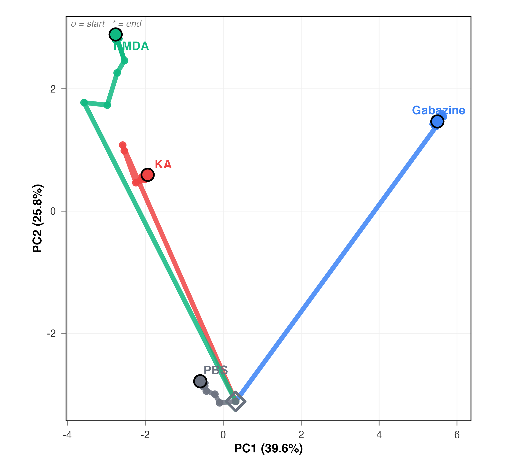
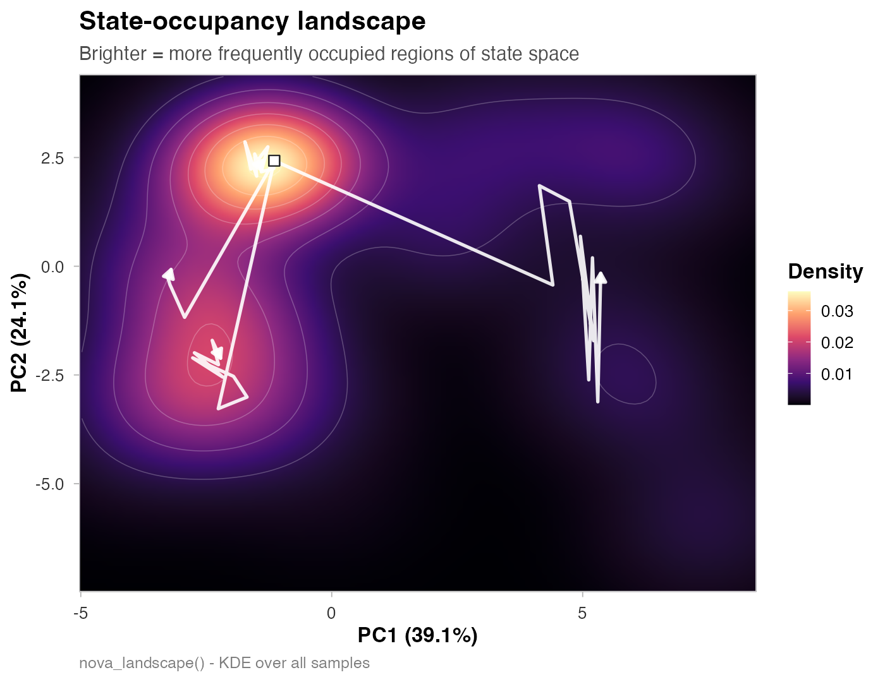
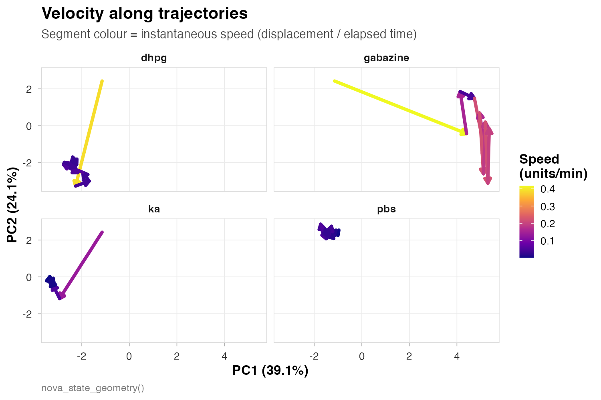
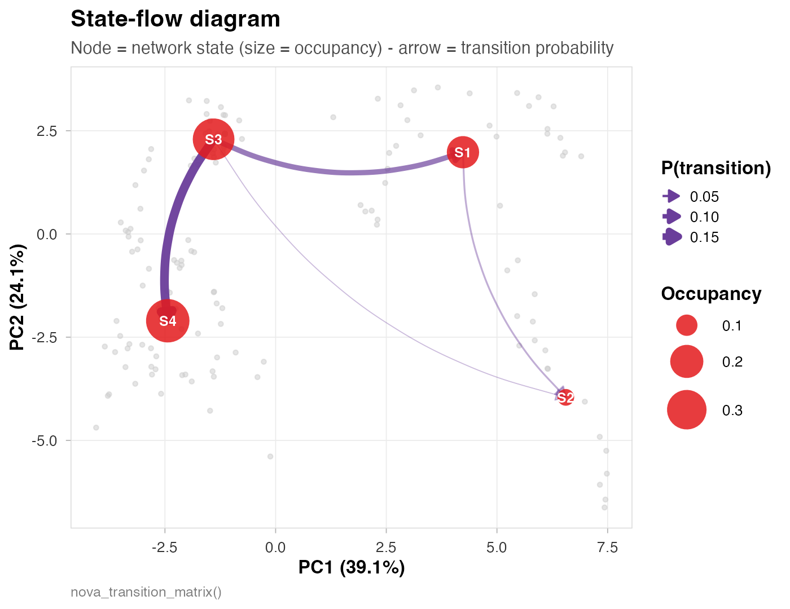

# NOVA
**Neural Output Visualization and Analysis** — a dynamical-systems toolkit for neuronal network state analysis.

[](https://www.gnu.org/licenses/gpl-3.0) [](https://github.com/atudoras/nova/releases) [](https://cran.r-project.org/) [](https://lifecycle.r-lib.org/articles/stages.html#experimental)

NOVA turns high-dimensional Multi-Electrode Array (MEA) recordings into interpretable **neuronal state-space representations** — and then analyses how those networks *move* through state space over time. From raw Axion CSVs to publication-ready figures in a few lines of code.

> **Where is the network? → Where is it moving, what state is it approaching, and how stable is that state?**

<table align="center" width="100%" border="0" cellspacing="0" cellpadding="10">
<tr>
<td align="center" width="50%">
  
  <br><em>Treatment groups traced through PCA state space over time.</em>
</td>
<td align="center" width="50%">
  
  <br><em><b>New in 0.2.0:</b> the state-occupancy landscape — where networks spend their time.</em>
</td>
</tr>
</table>

---

## What NOVA gives you

NOVA has two layers that share one workflow — you never re-run PCA to do dynamics.

| Layer | What it answers | Functions |
|---|---|---|
| **State-space visualization** | *Where* is each network? | `process_mea_flexible`, `pca_analysis_enhanced`, `pca_plots_enhanced`, `plot_pca_trajectories_general`, `create_mea_heatmaps_enhanced`, `plot_mea_metric` |
| **Dynamics** *(new in 0.2.0)* | *Where is it going, and how stable is it?* | `nova_state_geometry`, `nova_transition_matrix`, `nova_trajectory_similarity`, `nova_dynamical_regime`, `nova_landscape`, `nova_describe`, `nova_dynamics` |

---

## Installation

```r
# install.packages("remotes")
remotes::install_github("atudoras/nova")
```

Already using NOVA? This is a **drop-in update** — every existing function keeps the same name, arguments, and output. Nothing in your current scripts needs to change.

---

## Quick start — from raw data to state space

```r
library(NOVA)

# 1. Process MEA CSVs across timepoints, normalise to baseline
processed <- process_mea_flexible(
  main_dir            = "path/to/your/MEA_data",
  grouping_variables  = c("Experiment", "Treatment", "Well"),
  baseline_timepoint  = "baseline"
)

# 2. PCA (the shared state space)
pca <- pca_analysis_enhanced(processing_result = processed,
                             grouping_variables = "Treatment")

# 3. Trajectories — timepoints ordered correctly (baseline first; 1h15 < 1h30 < 1h45)
plot_pca_trajectories_general(
  pca, trajectory_grouping = "Treatment",
  timepoint_order = nova_order_timepoints(pca$plot_data$Timepoint)
)
```

---

## Dynamics — analyse how networks move

The whole dynamics layer runs on the PCA you already computed (or any embedding: UMAP, latent spaces). Run it all in one call:

```r
dyn <- nova_dynamics(pca, group_var = "Treatment")
nova_describe(dyn)        # plain-English interpretation of every result
dyn$regime$plots$overlay  # or pull any individual figure
```

<table align="center" width="100%" border="0" cellspacing="0" cellpadding="10">
<tr>
<td align="center" width="50%">
  
  <br><em><code>nova_state_geometry()</code> — speed along each path (real elapsed time). The vehicle barely moves; agonists jump fast, then settle.</em>
</td>
<td align="center" width="50%">
  
  <br><em><code>nova_transition_matrix()</code> — discrete network states and the probabilities of moving between them.</em>
</td>
</tr>
</table>

Each function returns metric tables **and** ggplot figures, and feeds `nova_describe()`:

| Function | Quantifies | Key outputs |
|---|---|---|
| `nova_state_geometry()` | Path length, displacement, velocity, acceleration, tortuosity, directional persistence | overlay · velocity · displacement plots |
| `nova_transition_matrix()` | k-means network states; empirical transition probabilities; occupancy; recurrent vs transient | transition heatmap · state-flow diagram |
| `nova_trajectory_similarity()` | Trajectory distance (Dynamic Time Warping, Fréchet, Euclidean, cosine) + clustering | distance matrix · dendrogram |
| `nova_dynamical_regime()` | stable / convergent / divergent / oscillatory / transitional + confidence | classification · regime overlay |
| `nova_landscape()` | State-occupancy density; pseudo-potential *U = −log p* | density · potential · occupancy maps |
| `nova_describe()` | Rule-based natural-language interpretation (no AI/API) | character summary |
| `nova_dynamics()` | One-call wrapper for the whole pipeline | combined result object |

> `nova_describe()` example output:
> *"Treatment 'PBS' remains near a fixed configuration (little net movement), consistent with a network at or near an attractor. 'KA' moves in a directed fashion and then decelerates, consistent with approach toward a stable network state."*

**Try it now** — `Example/nova_dynamics_quickstart.R` runs end-to-end on bundled demo data:

```r
library(NOVA)
source("Example/nova_dynamics_quickstart.R")   # set your data folder, or run as-is to demo
```

A full walkthrough is in the [**NOVA Dynamics tutorial**](vignettes/NOVA_Dynamics_Tutorial.Rmd).

---

## What's new in 0.2.0

- **`nova_dynamics` module** — trajectory geometry, state transitions, trajectory similarity, dynamical-regime detection, occupancy landscapes, and a rule-based interpretation layer.
- **Smarter timepoint ordering** — `nova_order_timepoints()` / `nova_time_to_minutes()` parse `min` / `h` / `s` / `day` / `DIV` / compound (`1h30`) labels, always put **baseline first**, and order by real elapsed time (fixes `1h15` sorting before `1h`).
- **No new required dependencies** — Dynamic Time Warping and Fréchet distance are implemented in base R; `dtw`, `igraph`, `MASS`, `patchwork` are optional.
- **Fully backward compatible** — no existing function changed. ([full release notes](https://github.com/atudoras/nova/releases/tag/v0.2.0))

---

## Data format

NOVA reads the directory layout Axion BioSystems software exports:

- **One folder per MEA plate**, named `MEA` + digits (e.g. `MEA001`, `MEA016a`)
- **One CSV per timepoint** inside it, named `<plate>_<timepoint>.csv` (e.g. `MEA001_baseline.csv`, `MEA001_1h.csv`)
- **Timepoint labels** can be any string after the underscore — `baseline`, `0min`, `1h30`, `DIV7`; NOVA finds the metadata row automatically and orders timepoints by real time.

```
MEA_data/
├── MEA001/
│   ├── MEA001_baseline.csv
│   ├── MEA001_1h.csv
│   └── MEA001_24h.csv
└── MEA002/
    ├── MEA002_baseline.csv
    └── MEA002_1h.csv
```

---

## Documentation

- **Dynamics tutorial** — [`vignettes/NOVA_Dynamics_Tutorial.Rmd`](vignettes/NOVA_Dynamics_Tutorial.Rmd)
- **Illustrated user guide** — [`docs/user-guide/NOVA-User-Guide.md`](https://github.com/atudoras/nova/blob/main/docs/user-guide/NOVA-User-Guide.md)
- **Quickstart scripts** — `Example/nova_quickstart.R` (visualization) and `Example/nova_dynamics_quickstart.R` (dynamics)
- **Roadmap** — [`ROADMAP.md`](ROADMAP.md) (attractors, resilience, criticality, learning, closed-loop benchmarking)

---

## Citation

If you use NOVA in published research, please cite:

> Escoubas CC, Guney E, Tudoras Miravet À, Magee N, Phua R, Ruggero D, Molofsky AV, Weiss WA (2025). *NOVA: a novel R-package enabling multi-parameter analysis and visualization of neural activity in MEA recordings.* bioRxiv. https://doi.org/10.1101/2025.10.01.679841

---

## Contributing

Bug reports and feature requests are welcome via [GitHub Issues](https://github.com/atudoras/nova/issues). Pull requests should follow standard R package conventions and include tests where applicable. Questions: Alex Tudoras — alex.tudorasmiravet@ucsf.edu.

*NOVA is released under the [GPL-3 License](https://www.gnu.org/licenses/gpl-3.0).*
