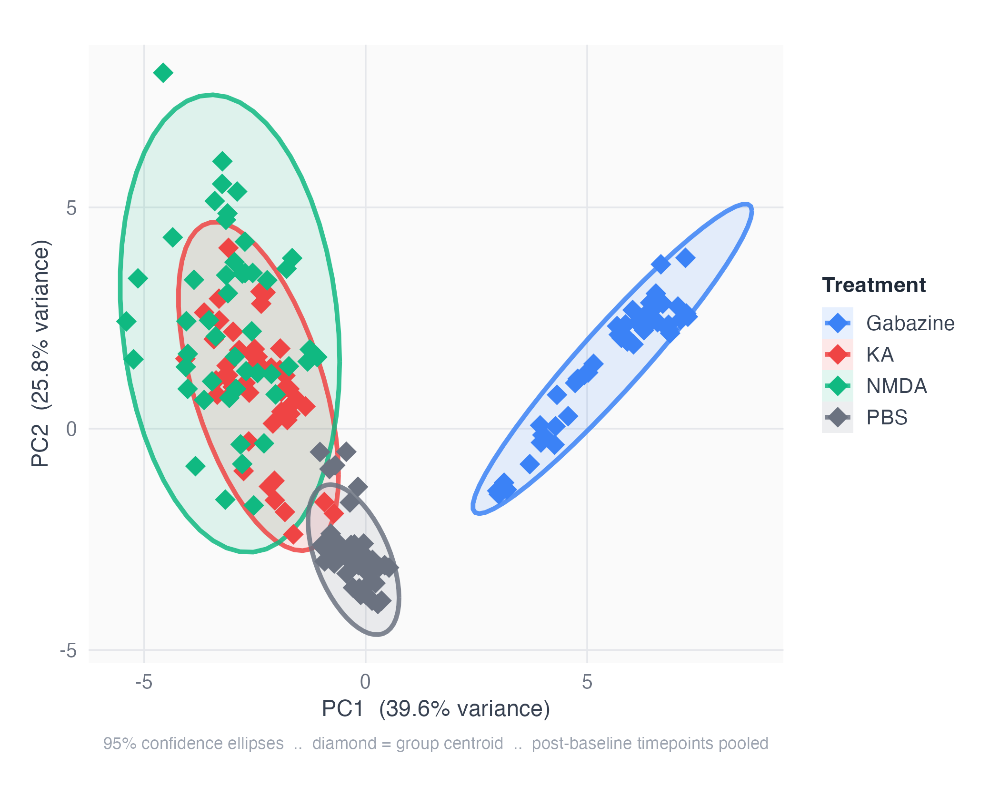
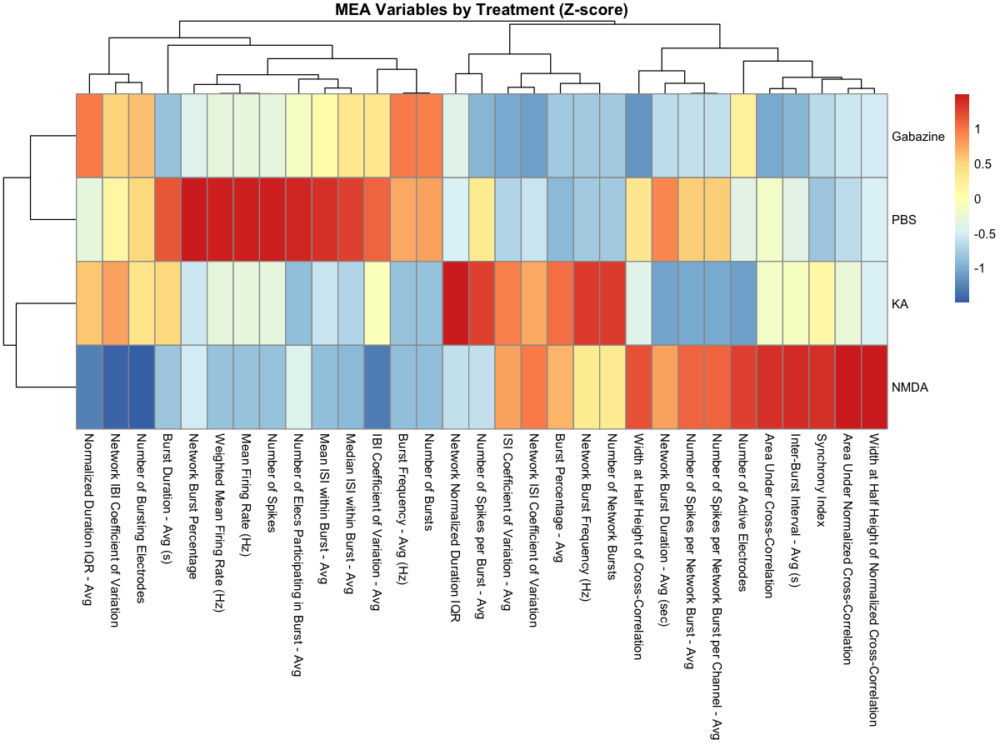
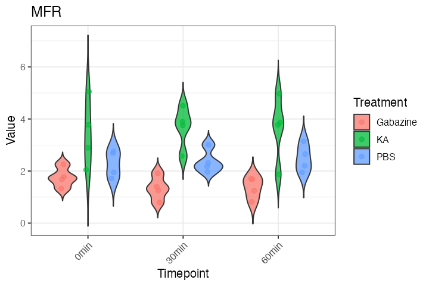
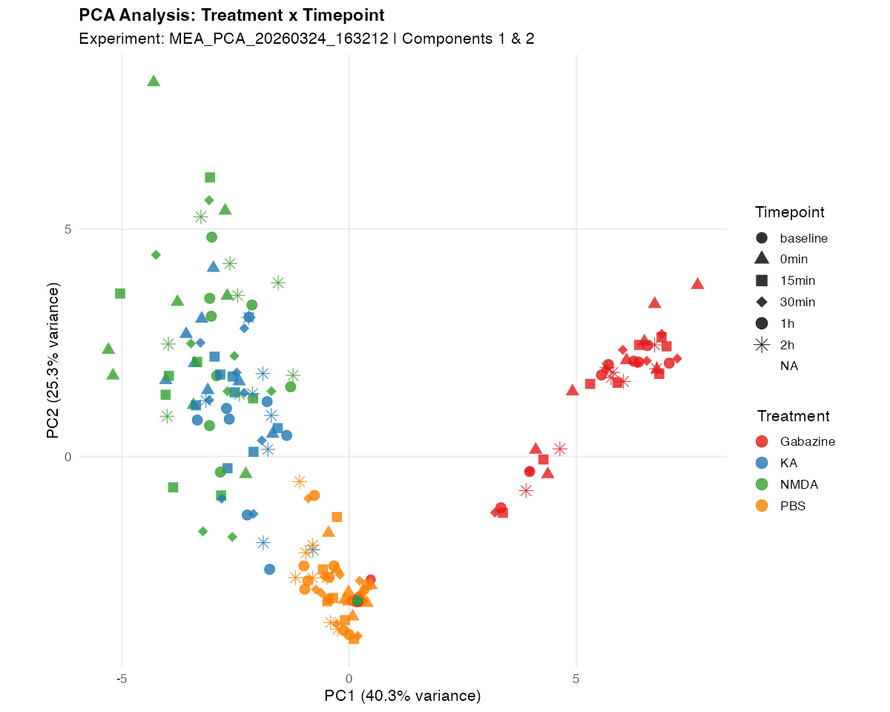

# NOVA
**Neural Output Visualization and Analysis** — turn MEA recordings into interpretable state-space figures.

[](https://www.gnu.org/licenses/gpl-3.0) [](https://github.com/atudoras/nova/releases) [](https://cran.r-project.org/) [](https://lifecycle.r-lib.org/articles/stages.html#experimental)

NOVA turns high-dimensional Multi-Electrode Array (MEA) recordings into interpretable **neuronal state-space representations** — from raw Axion CSV discovery through PCA, heatmaps, per-metric plots, and trajectory analysis — with publication-ready figures in a few lines of code.

<table align="center" width="100%" border="0" cellspacing="0" cellpadding="10">
<tr>
<td align="center" width="50%">
  
  <br><em>Treatment groups traced through PCA state space over time.</em>
</td>
<td align="center" width="50%">
  
  <br><em><b>New in 0.3.0:</b> how far each condition moved from baseline over time (mean ± SEM).</em>
</td>
</tr>
</table>

---

## Key features

- 🔍 **Smart data discovery** — auto-detects MEA folder structure and CSV metadata rows
- 📊 **PCA + trajectories** — track how neural populations evolve over time, with publication-ready scatter, ellipse, and trajectory plots
- 🔥 **Heatmaps & per-metric plots** — raw or normalized, with flexible faceting and filtering
- ⏱️ **Correct timepoint ordering** — baseline first, and `min` / `h` / `s` / `1h30` / `DIV7` labels sorted by real elapsed time
- 🧭 **Trajectory summary** *(new)* — a simple, honest description of how each condition moves away from baseline

---

## Gallery

Trajectories are just one view. Each of these is a single function call on the same processed data — the state-space, per-metric, and clustered-heatmap figures you actually put in a paper.

<table align="center" width="100%" border="0" cellspacing="0" cellpadding="10">
<tr>
<td align="center" width="50%">
  
  <br><em>PCA state space with 95% confidence ellipses per group — <code>pca_plots_enhanced()</code>.</em>
</td>
<td align="center" width="50%">
  
  <br><em>Every MEA metric, z-scored and clustered by condition — <code>create_mea_heatmaps_enhanced()</code>.</em>
</td>
</tr>
<tr>
<td align="center" width="50%">
  
  <br><em>Any single metric as bar / box / violin, split by group and timepoint — <code>plot_mea_metric()</code>.</em>
</td>
<td align="center" width="50%">
  
  <br><em>Two variables at once: colour by group, shape by timepoint — <code>pca_plots_enhanced()</code>.</em>
</td>
</tr>
</table>

---

## Installation

```r
# install.packages("remotes")
remotes::install_github("atudoras/nova")
```

> **Upgrading from 0.3.x or earlier? Your numbers will change, and the new ones are the
> correct ones.** Well IDs repeat on every plate, so `Experiment` is what tells two wells
> apart — and several functions did not use it. Multi-plate analyses were normalising wells
> against other plates' baselines, and the trajectory figure could render as a flat line at
> zero. See [NEWS.md](NEWS.md) for what changed and why. Single-plate analyses are largely
> unaffected.

---

## Quick start

```r
library(NOVA)

# 1. Read it. Axion's CSV export...
processed <- process_mea_flexible(
  main_dir           = "path/to/your/MEA_data",
  baseline_timepoint = "baseline"
)

# ...or any tidy table, including published datasets (see "Data format").
# processed <- process_mea_table(df, experiment = "plate", well = "well",
#                                timepoint = "div", treatment = "compound",
#                                metrics = c("firing_rate", "n_bursts"),
#                                normalize = "baseline")

# 2. PCA — the shared state space.
pca <- pca_analysis_enhanced(normalized_data = processed$normalized_data,
                             grouping_variables = "Treatment")

# 3. How did each condition move away from baseline?
traj <- nova_trajectory_summary(pca, group_var = "Treatment")
traj$plots$displacement   # distance from baseline over time, mean +/- SEM across wells
traj$plots$map            # the path through PC space
traj$metrics              # net displacement, path length, directness, peak timing

# 4. In plain language.
nova_describe(traj)
```

---

## Trajectory summary — how conditions move from baseline

`nova_trajectory_summary()` takes the PCA you already computed (or any embedding) and describes, simply and robustly, how each condition's network moved relative to its baseline — *how far*, *how directly*, and *when*. It reports only what this kind of data supports: distance travelled, path directness, and timing — no over-fitted velocities or regimes.

```r
s <- nova_trajectory_summary(pca, group_var = "Treatment")
s$metrics          # net displacement, path length, directness, peak timepoint
s$plots$displacement   # distance-from-baseline over time (mean ± SEM across wells)
s$plots$map            # the trajectory map in PC space
nova_describe(s)   # a plain-language summary
```

<table align="center" width="100%" border="0" cellspacing="0" cellpadding="10">
<tr>
<td align="center" width="50%">
  
  <br><em>The vehicle stays near baseline; agonists jump quickly and plateau.</em>
</td>
<td align="center" width="50%">
  
  <br><em>The same trajectories drawn in PC space (square = baseline).</em>
</td>
</tr>
</table>

> `nova_describe()` example output:
> *"Across 4 conditions, 'gabazine' moved farthest from baseline (7.00 PC units) and 'pbs' moved least (0.34). 'ka' moved 3.24 PC units from baseline via a moderately direct path, with most of the change by 15min."*

| Reported quantity | Meaning |
|---|---|
| `net_displacement` | Final distance from baseline (how far it ended up) |
| `path_length` | Total distance travelled along the trajectory |
| `directness` | `net / path` in [0,1] — 1 = straight out, low = wandering |
| `peak_timepoint` / `peak_displacement` | When (and how far) the network was most displaced |

---

## Function reference

**Read**

| Function | Description |
|---|---|
| `discover_mea_structure` | Scan a directory and report detected MEA experiments and timepoints |
| `process_mea_flexible` | Read and merge Axion CSV exports across experiments and timepoints |
| `process_mea_table` | Ingest an already-tidy table (published data, or your own); normalise to a baseline timepoint **or** to control wells |

**Analyse**

| Function | Description |
|---|---|
| `pca_analysis_enhanced` | Run PCA on the processed feature matrix |
| `nova_extract_trajectories` | Tidy, correctly ordered paths through an embedding |
| `nova_trajectory_summary` | How each condition moved from baseline: distance, path length, directness, timing |
| `nova_describe` | Plain-language read-out of a trajectory result (rule-based, no AI) |

**Plot**

| Function | Description |
|---|---|
| `pca_plots_enhanced` | PCA scatter, ellipses, loadings, variance plots |
| `plot_pca_trajectories_general` | Per-well and group-mean PCA trajectories across timepoints |
| `create_mea_heatmaps_enhanced` | Heatmaps of MEA metrics (raw or normalized) |
| `plot_mea_metric` | Bar/box/violin/line plot for a single MEA variable |

**Utilities**

| Function | Description |
|---|---|
| `nova_order_timepoints` / `nova_time_to_minutes` | Baseline-first timepoint ordering; parses `1h30`, `90min`, `DIV7` |
| `nova_unit_cols` / `nova_unit_id` | What identifies one replicate well. Ask these rather than counting on `Well`: well IDs repeat across plates, so `n_distinct(Well)` merges the same ID from different plates into one replicate and understates your replication |
| `nova_theme` / `nova_palette` | Consistent figure styling |

---

## Data format

NOVA takes two kinds of input.

### 1. Axion CSV exports — `process_mea_flexible()`

The directory layout Axion BioSystems software produces:

- **One folder per MEA plate**, named `MEA` + digits (e.g. `MEA001`, `MEA016a`)
- **One CSV per timepoint** inside it, named `<plate>_<timepoint>.csv` (e.g. `MEA001_baseline.csv`, `MEA001_1h.csv`)
- **Timepoint labels** can be any string after the underscore — `baseline`, `0min`, `1h30`, `DIV7`; NOVA finds the metadata rows automatically and orders timepoints by real time.

```
MEA_data/
├── MEA001/
│   ├── MEA001_baseline.csv
│   ├── MEA001_1h.csv
│   └── MEA001_24h.csv
└── MEA002/
    ├── MEA002_baseline.csv
    └── MEA002_1h.csv
```

### 2. Any tidy table — `process_mea_table()`

Published datasets essentially never arrive in the Axion layout. They arrive as a plain
table: one row per well × timepoint, metrics in columns (or already in long form).
`process_mea_table()` maps that onto the same schema, so everything downstream is identical.

```r
res <- process_mea_table(
  df,
  experiment = c("culture_date", "plate_id"),  # see below
  well       = "well",
  timepoint  = "DIV",         # "DIV7" and "1h30" both parse to real time
  treatment  = "compound",
  metrics    = c("meanfiringrate", "burst.per.min", "nAE"),
  normalize  = "control",     # or "baseline", or "none"
  control    = df$dose == 0   # which wells are the controls
)
```

**`experiment` often needs more than one column, and getting it wrong is silent.** A well is
only identified once you know which experiment it came from — and the experiment is not
always one column. In the EPA dataset used in [`case_studies/`](case_studies/), plate serial
numbers are *reused across culture dates*: four serials, six experiments. Keying on the
serial alone merges two different cultures into one well. Pass every column that identifies
the experiment.

**Normalisation is a choice, not a default.** `"baseline"` divides each well by its own
earliest timepoint — a fold-change over time. `"control"` divides by the control wells on the
same plate at the same timepoint — the toxicology convention, and the only workable option
when the earliest timepoint is not a usable reference (in a developmental assay, every well
may be silent at the first timepoint, making the ratio undefined). Both are ratios: undefined
against zero, which yields `NA`, never `Inf`.

---

## Documentation

- **Quickstart script** — `Example/nova_quickstart.R` (set `DATA_DIR`, run, get all figures)
- **Trajectory tutorial** — [`vignettes/NOVA_Trajectory_Summary.Rmd`](vignettes/NOVA_Trajectory_Summary.Rmd)
- **Illustrated user guide** — [`docs/user-guide/NOVA-User-Guide.md`](https://github.com/atudoras/nova/blob/main/docs/user-guide/NOVA-User-Guide.md)

---

## Citation

If you use NOVA in published research, please cite:

> Escoubas CC, Guney E, Tudoras Miravet À, Magee N, Phua R, Ruggero D, Molofsky AV, Weiss WA (2025). *NOVA: a novel R-package enabling multi-parameter analysis and visualization of neural activity in MEA recordings.* bioRxiv. https://doi.org/10.1101/2025.10.01.679841

---

## Contributing

Bug reports and feature requests are welcome via [GitHub Issues](https://github.com/atudoras/nova/issues). Pull requests should follow standard R package conventions and include tests where applicable. Questions: Alex Tudoras — alex.tudorasmiravet@ucsf.edu.

*NOVA is released under the [GPL-3 License](https://www.gnu.org/licenses/gpl-3.0).*
