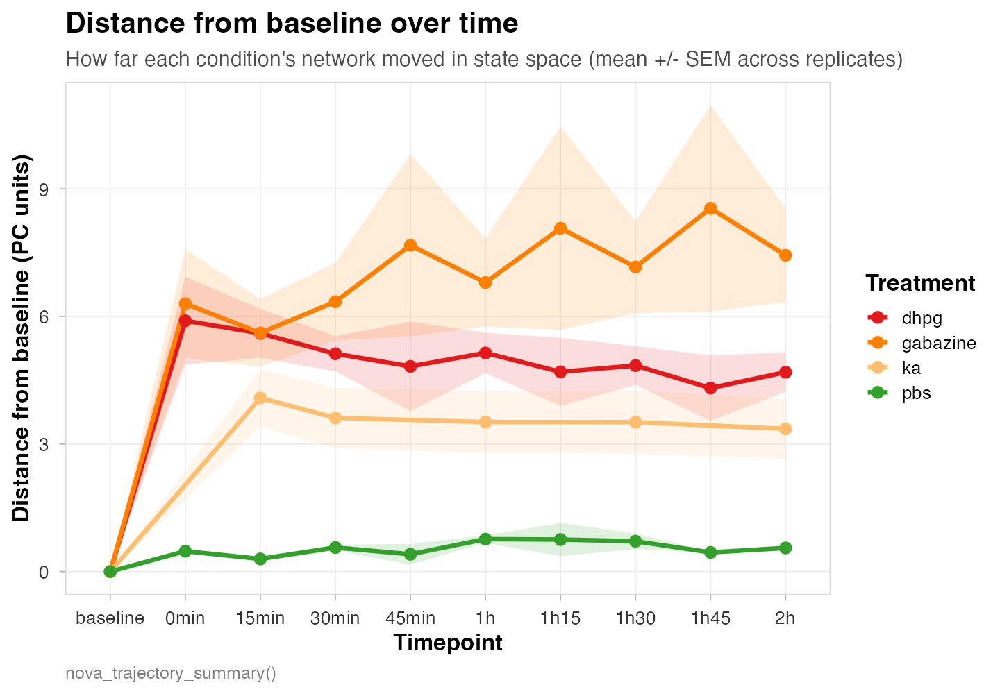
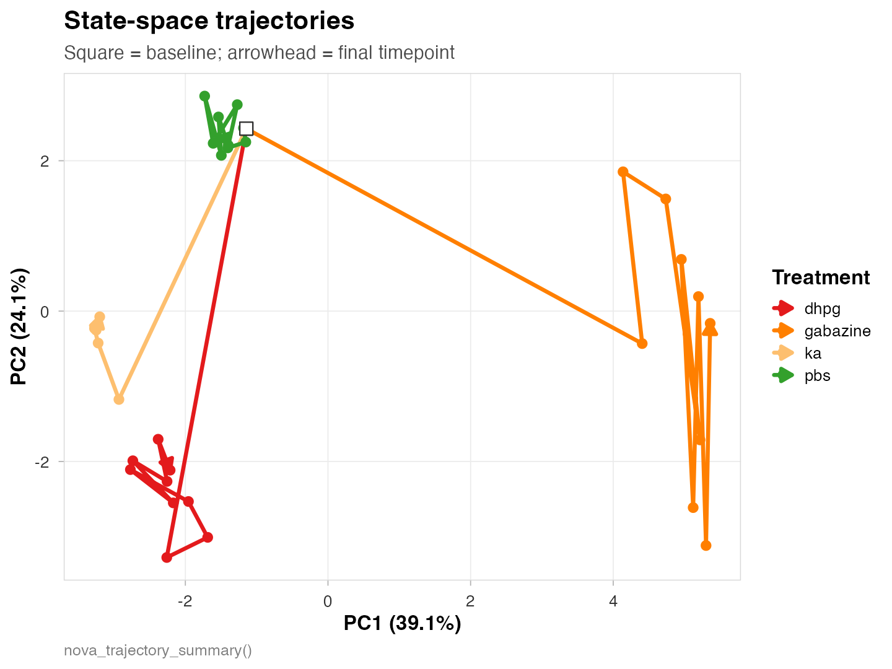

# NOVA
**Neural Output Visualization and Analysis** — turn MEA recordings into interpretable state-space figures.

[](https://www.gnu.org/licenses/gpl-3.0) [](https://github.com/atudoras/nova/releases) [](https://cran.r-project.org/) [](https://lifecycle.r-lib.org/articles/stages.html#experimental)

NOVA turns high-dimensional Multi-Electrode Array (MEA) recordings into interpretable **neuronal state-space representations** — from raw Axion CSV discovery through PCA, heatmaps, per-metric plots, and trajectory analysis — with publication-ready figures in a few lines of code.

<table align="center" width="100%" border="0" cellspacing="0" cellpadding="10">
<tr>
<td align="center" width="50%">
  
  <br><em>Treatment groups traced through PCA state space over time.</em>
</td>
<td align="center" width="50%">
  
  <br><em><b>New in 0.3.0:</b> how far each condition moved from baseline over time (mean ± SEM).</em>
</td>
</tr>
</table>

---

## Key features

- 🔍 **Smart data discovery** — auto-detects MEA folder structure and CSV metadata rows
- 📊 **PCA + trajectories** — track how neural populations evolve over time, with publication-ready scatter, ellipse, and trajectory plots
- 🔥 **Heatmaps & per-metric plots** — raw or normalized, with flexible faceting and filtering
- ⏱️ **Correct timepoint ordering** — baseline first, and `min` / `h` / `s` / `1h30` / `DIV7` labels sorted by real elapsed time
- 🧭 **Trajectory summary** *(new)* — a simple, honest description of how each condition moves away from baseline

---

## Installation

```r
# install.packages("remotes")
remotes::install_github("atudoras/nova")
```

Already using NOVA? This is a **drop-in update** — every existing function keeps the same name, arguments, and output. Nothing in your current scripts needs to change.

---

## Quick start

```r
library(NOVA)

# 1. Process MEA CSVs across timepoints, normalise to baseline
processed <- process_mea_flexible(
  main_dir            = "path/to/your/MEA_data",
  grouping_variables  = c("Experiment", "Treatment", "Well"),
  baseline_timepoint  = "baseline"
)

# 2. PCA (the shared state space)
pca <- pca_analysis_enhanced(processing_result = processed,
                             grouping_variables = "Treatment")

# 3. Trajectories — timepoints ordered correctly (baseline first; 1h15 < 1h30 < 1h45)
plot_pca_trajectories_general(
  pca, trajectory_grouping = "Treatment",
  timepoint_order = nova_order_timepoints(pca$plot_data$Timepoint)
)
```

---

## Trajectory summary — how conditions move from baseline

`nova_trajectory_summary()` takes the PCA you already computed (or any embedding) and describes, simply and robustly, how each condition's network moved relative to its baseline — *how far*, *how directly*, and *when*. It reports only what this kind of data supports: distance travelled, path directness, and timing — no over-fitted velocities or regimes.

```r
s <- nova_trajectory_summary(pca, group_var = "Treatment")
s$metrics          # net displacement, path length, directness, peak timepoint
s$plots$displacement   # distance-from-baseline over time (mean ± SEM across wells)
s$plots$map            # the trajectory map in PC space
nova_describe(s)   # a plain-language summary
```

<table align="center" width="100%" border="0" cellspacing="0" cellpadding="10">
<tr>
<td align="center" width="50%">
  
  <br><em>The vehicle stays near baseline; agonists jump quickly and plateau.</em>
</td>
<td align="center" width="50%">
  
  <br><em>The same trajectories drawn in PC space (square = baseline).</em>
</td>
</tr>
</table>

> `nova_describe()` example output:
> *"Across 4 conditions, 'gabazine' moved farthest from baseline (7.00 PC units) and 'pbs' moved least (0.34). 'ka' moved 3.24 PC units from baseline via a moderately direct path, with most of the change by 15min."*

| Reported quantity | Meaning |
|---|---|
| `net_displacement` | Final distance from baseline (how far it ended up) |
| `path_length` | Total distance travelled along the trajectory |
| `directness` | `net / path` in [0,1] — 1 = straight out, low = wandering |
| `peak_timepoint` / `peak_displacement` | When (and how far) the network was most displaced |

---

## Function reference

| Function | Description |
|---|---|
| `discover_mea_structure` | Scan a directory and report detected MEA experiments and timepoints |
| `process_mea_flexible` | Read and merge CSVs across experiments and timepoints; normalize to baseline |
| `pca_analysis_enhanced` | Run PCA on the processed feature matrix |
| `pca_plots_enhanced` | PCA scatter, ellipses, loadings, variance plots |
| `plot_pca_trajectories_general` | Mean PCA trajectories across timepoints per group |
| `create_mea_heatmaps_enhanced` | Heatmaps of MEA metrics (raw or normalized) |
| `plot_mea_metric` | Bar/box/violin/line plot for a single MEA variable |
| `nova_trajectory_summary` | Describe how conditions move from baseline (distance, directness, timing) |
| `nova_order_timepoints` / `nova_time_to_minutes` | Robust, baseline-first timepoint ordering |
| `nova_describe` | Plain-language summary of a trajectory result |

---

## Data format

NOVA reads the directory layout Axion BioSystems software exports:

- **One folder per MEA plate**, named `MEA` + digits (e.g. `MEA001`, `MEA016a`)
- **One CSV per timepoint** inside it, named `<plate>_<timepoint>.csv` (e.g. `MEA001_baseline.csv`, `MEA001_1h.csv`)
- **Timepoint labels** can be any string after the underscore — `baseline`, `0min`, `1h30`, `DIV7`; NOVA finds the metadata row automatically and orders timepoints by real time.

```
MEA_data/
├── MEA001/
│   ├── MEA001_baseline.csv
│   ├── MEA001_1h.csv
│   └── MEA001_24h.csv
└── MEA002/
    ├── MEA002_baseline.csv
    └── MEA002_1h.csv
```

---

## Documentation

- **Quickstart script** — `Example/nova_quickstart.R` (set `DATA_DIR`, run, get all figures)
- **Trajectory tutorial** — [`vignettes/NOVA_Trajectory_Summary.Rmd`](vignettes/NOVA_Trajectory_Summary.Rmd)
- **Illustrated user guide** — [`docs/user-guide/NOVA-User-Guide.md`](https://github.com/atudoras/nova/blob/main/docs/user-guide/NOVA-User-Guide.md)

---

## Citation

If you use NOVA in published research, please cite:

> Escoubas CC, Guney E, Tudoras Miravet À, Magee N, Phua R, Ruggero D, Molofsky AV, Weiss WA (2025). *NOVA: a novel R-package enabling multi-parameter analysis and visualization of neural activity in MEA recordings.* bioRxiv. https://doi.org/10.1101/2025.10.01.679841

---

## Contributing

Bug reports and feature requests are welcome via [GitHub Issues](https://github.com/atudoras/nova/issues). Pull requests should follow standard R package conventions and include tests where applicable. Questions: Alex Tudoras — alex.tudorasmiravet@ucsf.edu.

*NOVA is released under the [GPL-3 License](https://www.gnu.org/licenses/gpl-3.0).*
