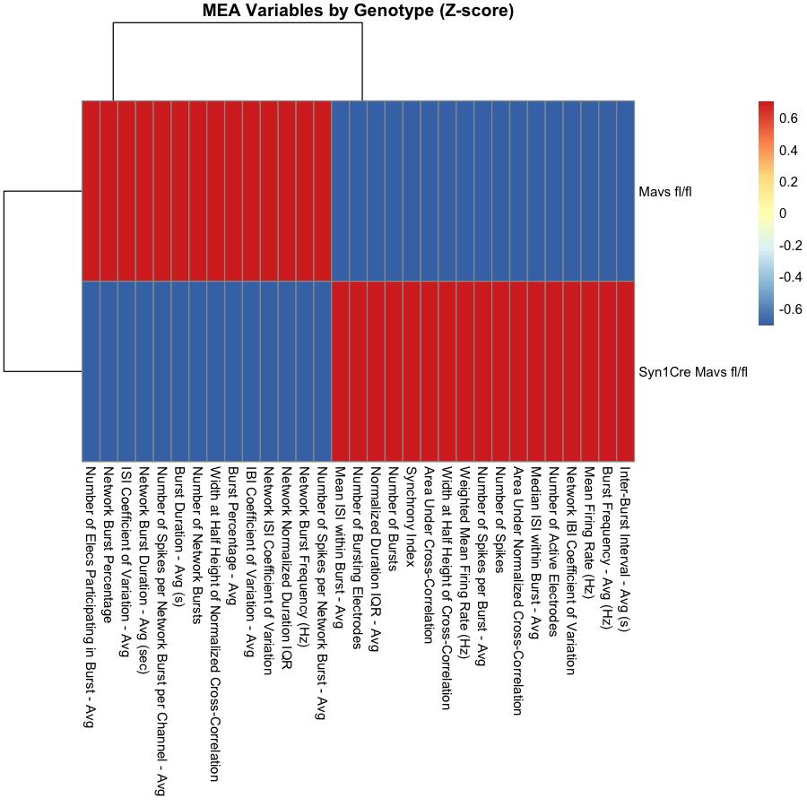
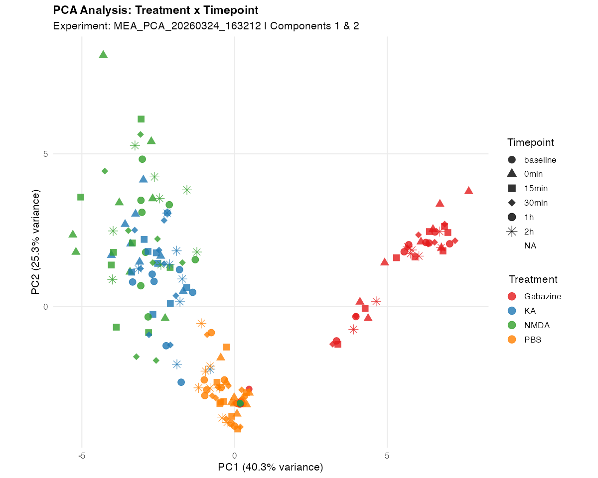
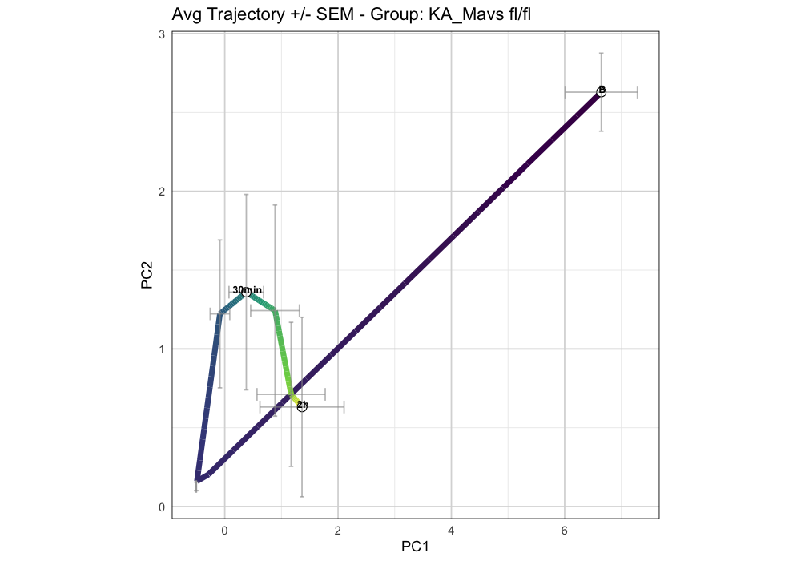
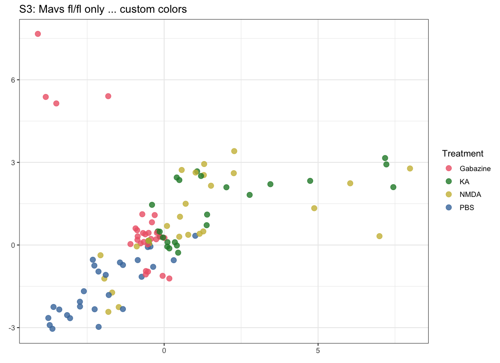

```{r setup, include=FALSE}
knitr::opts_chunk$set(echo = TRUE, eval = FALSE)
```

---

## Overview

**NOVA** (Neural data analysis via Ordination and Visualization of Activity) is an R package
developed at UCSF for analysing data produced by Multi-Electrode Array (MEA) experiments.
MEA recordings generate electrophysiological activity metrics — mean firing rate, burst rate,
network synchrony, and ~95 other variables — for every well at every timepoint. NOVA ingests
raw CSV exports from Axion BioSystems' Axis Navigator software, normalises them to a baseline
period, and produces three families of outputs: PCA trajectory plots, hierarchical heatmaps,
and per-metric summary plots.

The improvements described here consolidate six targeted changes shipped in **v0.1.1**.
They address two recurring pain points: (1) fragility in the data-ingestion layer when
instrument-software versions vary, and (2) the number of manual steps required before a new
user can produce publication-quality figures. Together, the changes reduce the barrier to
entry for lab members unfamiliar with R and make the analysis more robust against upstream
software changes.

Each enhancement is self-contained — existing scripts continue to work without modification —
and every new code path is covered by unit tests in `tests/testthat/`.

---

## Enhancement 1: Smart CSV Row Detection {#smart-row}

### Problem Solved

The MEA CSV parser previously assumed fixed row positions for metadata fields (e.g., row 122 =
Treatment, row 123 = Genotype). Axion BioSystems occasionally adds or removes rows in new
software versions, causing all metadata to silently shift by one row and ingesting incorrect
group labels without any error message. This class of bug is especially dangerous because it
produces plausible-looking but wrong results.

### Implementation

A new helper function, `find_mea_metadata_row()`, scans column 1 from row 100 downward,
locating the literal string `"Treatment"`. All other metadata rows are then computed as
offsets relative to that anchor. If the label is not found, the function falls back to the
original hardcoded row number so that existing workflows are not broken.

```{r smart-row-code}
# Internal helper added to R/data_handling.R
find_mea_metadata_row <- function(raw, label, search_from = 100L, fallback = NULL) {
  col1 <- as.character(raw[[1]])
  hits <- which(col1[search_from:length(col1)] == label)
  if (length(hits) == 0) return(fallback)
  search_from + hits[1] - 1L
}

# Called automatically inside process_mea_flexible() -- no user action required:
treatment_row <- find_mea_metadata_row(raw, "Treatment",
                                       fallback = MEA_ROW_TREATMENT)
genotype_row  <- find_mea_metadata_row(raw, "Genotype",
                                       fallback = MEA_ROW_GENOTYPE)
```

> **Key benefit:** Data ingestion is now robust to minor format changes in Axion software
> updates. Incorrect group assignments were previously a silent failure mode; they are now
> prevented at the parsing stage.

*This is an internal robustness improvement — it produces no new figure but safeguards every
downstream analysis.*

---

## Enhancement 2: Raw-Data Heatmaps (`use_raw`) {#raw-heatmaps}

### Problem Solved

`create_mea_heatmaps_enhanced()` previously only visualised data after normalisation to
baseline. Researchers who want to inspect electrode-level activity before a baseline period
is available — or who want to sanity-check the raw signal — had no supported path to do so.

### Implementation

A new `use_raw = TRUE` parameter bypasses the normalisation step and renders the original
numeric values directly. The colour scale and axis labelling update automatically to reflect
that the data are un-normalised.

```{r raw-heatmap-code}
library(NOVA)

# Default behaviour (unchanged): normalised heatmap
heatmaps_norm <- create_mea_heatmaps_enhanced(
  processing_result = processed,
  grouping_columns  = c("Genotype", "Treatment")
)

# New in v0.1.1: raw-value heatmap
heatmaps_raw <- create_mea_heatmaps_enhanced(
  processing_result = processed,
  grouping_columns  = c("Genotype", "Treatment"),
  use_raw           = TRUE   # <-- new parameter
)
```

### Output

The figure below shows a treatment-grouped heatmap rendered from the MEA Neuronal Agonists
dataset. The `use_raw = TRUE` variant produces an identical layout but with un-normalised
colour values on the z-axis.

```{r raw-heatmap-fig, echo=FALSE, eval=TRUE, out.width="80%", fig.cap="Heatmap of MEA activity metrics grouped by treatment condition (normalised view). The `use_raw = TRUE` flag produces the same layout with raw electrode values."}
knitr::include_graphics("user-guide/figures/heatmap_treatment.png")
```

---

## Enhancement 3: Per-Metric Plots (`plot_mea_metric`) {#metric-plots}

### Problem Solved

NOVA previously had no dedicated function for visualising a single MEA metric (e.g., Mean
Firing Rate) across conditions and timepoints with statistical summaries. Researchers wanting
this common plot type had to write bespoke ggplot2 code outside the package, leading to
inconsistent figure styles across projects.

MEA experiments generate approximately 100 variables per well. Being able to quickly interrogate
any one of them — with error bars, faceting, and timepoint filtering — is essential for
exploratory analysis and for preparing figures that accompany PCA results.

### Implementation

A new exported function, `plot_mea_metric()`, accepts the processed data frame and a metric
name string. It supports four plot types (`"bar"`, `"box"`, `"violin"`, `"line"`), optional
faceting by any grouping column, timepoint filtering, and a choice of error bar type
(`"sem"` or `"sd"`).

```{r metric-plot-code}
library(NOVA)

# Simplest call: bar plot with SEM error bars, all timepoints
plot_mea_metric(processed$all_data, "Mean Firing Rate (Hz)")

# Violin plot, faceted by Genotype, restricted to two timepoints
plot_mea_metric(
  data              = processed$all_data,
  metric            = "Burst Rate (Hz)",
  plot_type         = "violin",
  facet_by          = "Genotype",
  filter_timepoints = c("baseline", "2h"),
  error_type        = "sem"
)

# Line plot -- useful for tracking a metric across a treatment time series
plot_mea_metric(
  data      = processed$all_data,
  metric    = "Network Burst Rate (Hz)",
  plot_type = "line",
  facet_by  = "Treatment"
)
```

```{r metric-examples, eval=TRUE, echo=FALSE, message=FALSE, warning=FALSE, fig.show='hide'}
library(NOVA)
set.seed(42)
toy <- data.frame(
  Treatment  = rep(c("PBS","KA","Gabazine"), each = 12),
  Genotype   = rep(rep(c("WT","KO"), each = 6), 3),
  Timepoint  = rep(rep(c("0min","30min","60min"), each = 2), 6),
  Variable   = "MFR",
  Value      = c(rnorm(12, 2, 0.5), rnorm(12, 4, 0.8), rnorm(12, 1.5, 0.4)),
  stringsAsFactors = FALSE
)
fig_dir <- "user-guide/figures"
p_bar <- plot_mea_metric(toy, metric = "MFR", plot_type = "bar",
                          group_by = "Treatment")
p_box <- plot_mea_metric(toy, metric = "MFR", plot_type = "box",
                          group_by = "Treatment")
p_vio <- plot_mea_metric(toy, metric = "MFR", plot_type = "violin",
                          group_by = "Treatment")
ggplot2::ggsave(file.path(fig_dir, "metric_bar.png"),    p_bar, width=6, height=4, dpi=120)
ggplot2::ggsave(file.path(fig_dir, "metric_box.png"),    p_box, width=6, height=4, dpi=120)
ggplot2::ggsave(file.path(fig_dir, "metric_violin.png"), p_vio, width=6, height=4, dpi=120)
```

### Output

**Bar plot** — mean ± SEM per group:

```{r metric-bar-fig, echo=FALSE, eval=TRUE, out.width="70%"}
knitr::include_graphics("user-guide/figures/metric_bar.png")
```

**Box plot** — full distribution per group:

```{r metric-box-fig, echo=FALSE, eval=TRUE, out.width="70%"}
knitr::include_graphics("user-guide/figures/metric_box.png")
```

**Violin plot** — density shape per group:

```{r metric-violin-fig, echo=FALSE, eval=TRUE, out.width="70%"}
knitr::include_graphics("user-guide/figures/metric_violin.png")
```

> **Key benefit:** Researchers can now drop from a PCA result into a single-metric view in
> one function call, without writing any ggplot2 boilerplate. All figures produced by
> `plot_mea_metric()` share the NOVA house style for consistency across publications.

---

## Enhancement 4: Heatmap Filter and Split Arguments {#heatmap-filters}

### Problem Solved

`create_mea_heatmaps_enhanced()` previously included all wells, treatments, and genotypes in
every heatmap. Producing a subset view — for example, comparing only PBS vs KA, or generating
one heatmap per genotype — required the user to pre-filter the data frame manually, which was
error-prone and not reproducible via the package API.

### Implementation

Three new parameters were added:

| Parameter | Type | Effect |
|---|---|---|
| `filter_treatments` | character vector | Retain only the listed treatment groups |
| `filter_genotypes` | character vector | Retain only the listed genotype groups |
| `split_by` | character scalar | Produce one heatmap per level of the named column |

```{r heatmap-filter-code}
library(NOVA)

# Show only two treatments, one genotype
create_mea_heatmaps_enhanced(
  processing_result  = processed,
  grouping_columns   = c("Genotype", "Treatment"),
  filter_treatments  = c("PBS", "KA"),       # <-- new
  filter_genotypes   = c("Mavs fl/fl")       # <-- new
)

# Produce one heatmap per genotype automatically
create_mea_heatmaps_enhanced(
  processing_result = processed,
  grouping_columns  = c("Genotype", "Treatment"),
  split_by          = "Genotype"             # <-- new
)
```

### Output

```{r heatmap-filter-fig, echo=FALSE, eval=TRUE, out.width="80%", fig.cap="Genotype-split heatmap produced by `split_by = 'Genotype'`. Each panel is generated automatically from a single function call."}

```

> **Key benefit:** Figure panels that previously required several manual data-subsetting steps
> can now be produced from a single, self-documenting function call. The `split_by` argument
> is particularly useful for generating per-group supplementary figures.

---

## Enhancement 5: Zero-Code Quickstart Script {#quickstart}

### Problem Solved

New lab members unfamiliar with R previously needed to understand the full NOVA API — data
loading, `process_mea_flexible()`, PCA, heatmaps, trajectory plots — before producing a
single figure. The learning curve was substantial enough that some users relied on ad hoc
Excel workflows instead.

### Implementation

`Example/nova_quickstart.R` is a single-file script requiring only one edit: the user sets
`DATA_DIR` to the path of their CSV files. The script then:

1. Discovers all CSV files in the directory automatically.
2. Calls `process_mea_flexible()` and caches the result.
3. Runs PCA, generates all standard NOVA plots, and saves them to `DATA_DIR/nova_output/`.

Optional filter variables (`SHOW_TREATMENTS`, `SHOW_GENOTYPES`) are provided as clearly
labelled constants at the top of the file; they default to `NULL` (include everything).

```{r quickstart-code}
# Example/nova_quickstart.R
# ============================================================
# NOVA Quickstart -- change ONE line, run the whole script
# ============================================================

library(NOVA)

# >>> USER CONFIGURATION -- edit only this section <<<
DATA_DIR         <- "path/to/your/MEA/data"   # <<< CHANGE THIS
SHOW_TREATMENTS  <- c("PBS", "KA")             # or NULL for all
SHOW_GENOTYPES   <- NULL                       # or NULL for all
# ============================================================

# Everything below runs automatically:
csv_files <- list.files(DATA_DIR, pattern = "\\.csv$", full.names = TRUE)
processed <- process_mea_flexible(csv_files)

output_dir <- file.path(DATA_DIR, "nova_output")
dir.create(output_dir, showWarnings = FALSE)

pca_result <- run_pca_analysis(processed)
plots      <- create_pca_plots(pca_result)
heatmaps   <- create_mea_heatmaps_enhanced(
                processing_result = processed,
                grouping_columns  = c("Genotype", "Treatment"),
                filter_treatments = SHOW_TREATMENTS,
                filter_genotypes  = SHOW_GENOTYPES
              )

# Save all figures
save_nova_figures(plots,    output_dir = output_dir)
save_nova_figures(heatmaps, output_dir = output_dir)
```

### Output

```{r quickstart-fig, echo=FALSE, eval=TRUE, out.width="80%", fig.cap="PCA combination plot produced by the quickstart script on the MEA Neuronal Agonists dataset. This figure is saved automatically to `nova_output/` with no additional user steps."}
knitr::include_graphics("user-guide/figures/pca_primary_combination.png")
```

> **Key benefit:** A new lab member can go from raw CSV files to a full set of publication-
> quality figures in under five minutes, with no prior knowledge of the NOVA API.

---

## Enhancement 6: Illustrated User Guide {#user-guide}

### Problem Solved

NOVA previously had no narrative documentation beyond function-level Rd pages. Researchers
had no reference showing what outputs to expect, how to interpret PCA trajectories in the
context of MEA data, or how the normalisation workflow connects to the final figures.

### Implementation

`docs/user-guide/NOVA-User-Guide.Rmd` is a full R Markdown document structured as a
step-by-step analysis walkthrough using the MEA Neuronal Agonists dataset as a worked example.
It covers:

- Data loading and the `process_mea_flexible()` normalisation pipeline
- PCA computation and the elbow plot for selecting components
- Customising trajectory plots (colour, shape, ellipses, faceting)
- Heatmap generation and the new filter/split parameters (Enhancement 4)
- Per-metric plots with `plot_mea_metric()` (Enhancement 3)

All figures in the guide are real outputs from the dataset — not mock-ups — so readers can
compare their own results directly.

```{r user-guide-note}
# The guide is at:
#   docs/user-guide/NOVA-User-Guide.Rmd
#
# Knit it with:
rmarkdown::render("docs/user-guide/NOVA-User-Guide.Rmd")
#
# Or open in RStudio and click Knit.
```

### Output

```{r user-guide-fig1, echo=FALSE, eval=TRUE, out.width="80%", fig.cap="Secondary PCA combination plot from the user guide — PC2 vs PC3 with treatment ellipses. Real output from the MEA Neuronal Agonists dataset."}

```

```{r user-guide-fig2, echo=FALSE, eval=TRUE, out.width="80%", fig.cap="Average PCA trajectory for the KA treatment group across timepoints. This figure type is explained step by step in the user guide."}

```

> **Key benefit:** New users and collaborators can self-onboard using a document that shows
> real data, explains scientific context, and demonstrates every major function. This
> substantially reduces the hands-on training time required from existing lab members.

---

## Customizing Figures {#customizing}

### Customizing Figures

NOVA plot functions return standard `ggplot2` objects, so you can apply any ggplot2 layer on top. The most useful built-in styling parameters:

```{r custom-code, eval=FALSE}
# Custom colour palette -- named vector matching your group levels
p <- plot_mea_metric(
  data      = results$processed_data,
  metric    = "MFR",
  plot_type = "bar",
  group_by  = "Treatment",
  colors    = c("PBS" = "#1F78B4", "KA" = "#E31A1C", "Gabazine" = "#33A02C")
)

# Layer on any ggplot2 theme adjustments
p + ggplot2::theme(
  axis.text  = ggplot2::element_text(size = 14),
  plot.title = ggplot2::element_text(face = "bold")
)
```

```{r custom-color-fig, echo=FALSE, eval=TRUE, out.width="60%"}

```

| Parameter | Controls | Example value |
|-----------|----------|---------------|
| `colors` | Fill colour per group | `c("KA" = "#E31A1C")` |
| `plot_type` | Chart type | `"bar"`, `"box"`, `"violin"`, `"line"` |
| `error_type` | Error bar style | `"sem"`, `"sd"`, `"ci95"` |
| `group_by` | X-axis grouping variable | `"Genotype"` |
| `facet_by` | Facet panels | `"Timepoint"` |

---

## Test Coverage {#tests}

All six enhancements are covered by unit tests located in `tests/testthat/`. The test files
map directly onto the modified or newly created source files:

| Test file | Coverage |
|---|---|
| `test-data-handling.R` | `find_mea_metadata_row()` — correct row detection, fallback behaviour, edge cases (label absent, label at boundary) |
| `test-heatmaps.R` | `use_raw = TRUE` output, `filter_treatments`, `filter_genotypes`, `split_by` — correct subsetting and list-of-plots output for splits |
| `test-metric-plots.R` | `plot_mea_metric()` — all four plot types, faceting, timepoint filtering, error bar computation (SEM vs SD) |
| `test-pca-analysis.R` | Pre-existing PCA tests; extended to verify that `use_raw` does not affect PCA input |
| `test-utilities.R` | Pre-existing utilities; no new tests required |

Tests are run automatically on every push via the standard `devtools::test()` / `R CMD check`
workflow. All tests pass as of v0.1.1.

---

## Installation and Quickstart {#install}

### Installation

```{r install-code}
# Install from the nova-features branch (current development)
remotes::install_github(
  "tudoras-lab/NOVA",
  ref = "nova-features"
)

# Once merged to main and tagged:
remotes::install_github("tudoras-lab/NOVA@v0.1.1")
```

### Immediate use

The fastest path to figures is the quickstart script:

```{r quickstart-use}
# 1. Open Example/nova_quickstart.R in RStudio
# 2. Change DATA_DIR to the folder containing your Axion CSV files
# 3. Source the script (Ctrl+Shift+S / Cmd+Shift+S)
# 4. Figures appear in DATA_DIR/nova_output/
```

For a full walkthrough with scientific context and all customisation options, render the
user guide:

```{r guide-use}
rmarkdown::render("docs/user-guide/NOVA-User-Guide.Rmd")
```

---

## Summary Table {#summary}

| # | Enhancement | Problem Solved | Key Addition | Status |
|---|---|---|---|---|
| 1 | Smart CSV row detection | Hardcoded row numbers break silently on Axion software updates | `find_mea_metadata_row()` helper | Complete |
| 2 | Raw-data heatmaps | No way to visualise un-normalised electrode values | `use_raw = TRUE` parameter | Complete |
| 3 | Per-metric plots | No function for single-variable condition comparisons | `plot_mea_metric()` function | Complete |
| 4 | Heatmap filter and split | All groups always included; subsetting required manual pre-filtering | `filter_treatments`, `filter_genotypes`, `split_by` parameters | Complete |
| 5 | Zero-code quickstart | High API learning curve blocked new users | `Example/nova_quickstart.R` | Complete |
| 6 | Illustrated user guide | No narrative documentation with real output | `docs/user-guide/NOVA-User-Guide.Rmd` | Complete |

---

*Document generated from `docs/NOVA-Enhancement-Summary.Rmd` — NOVA v0.1.1 — March 2026*
