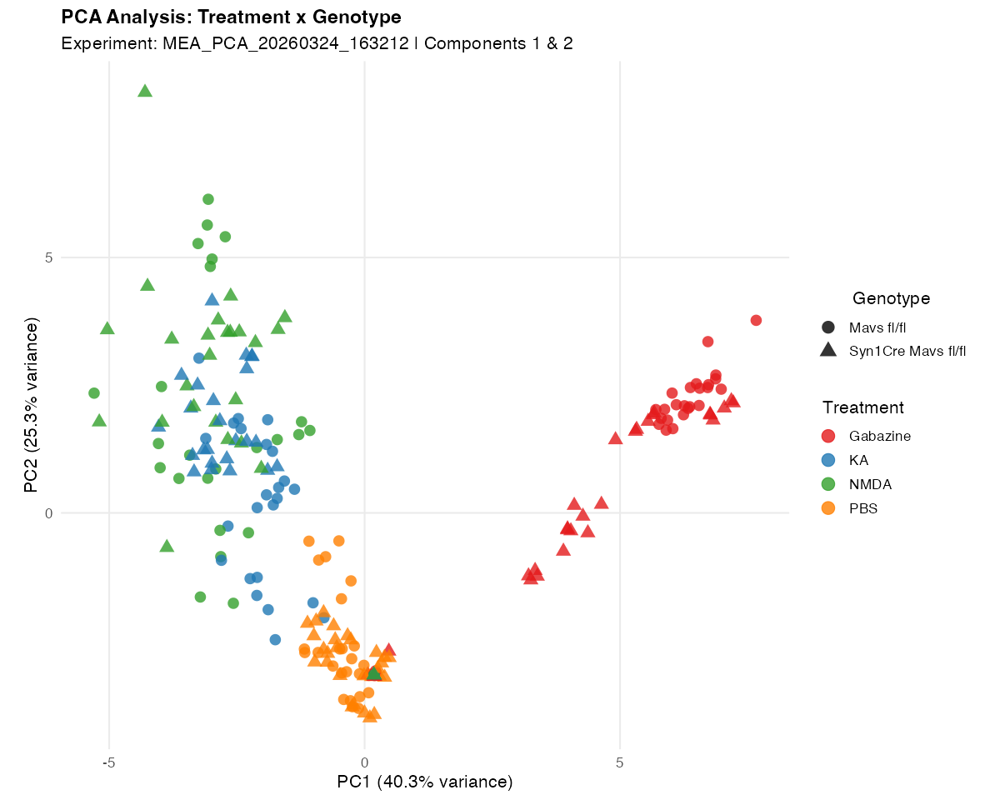
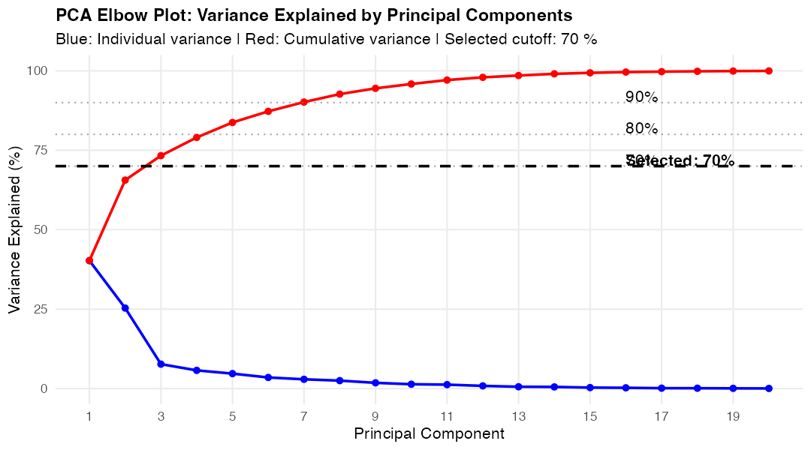
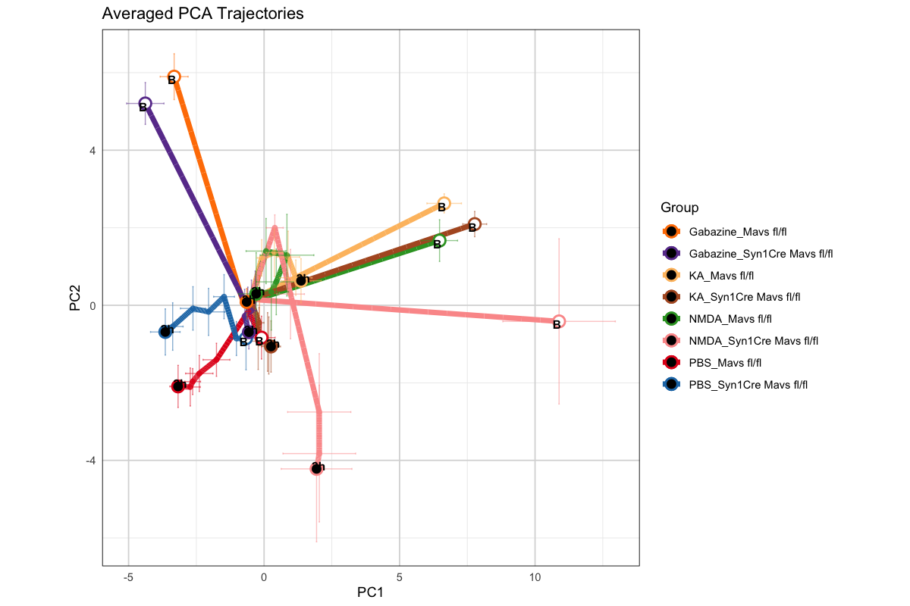
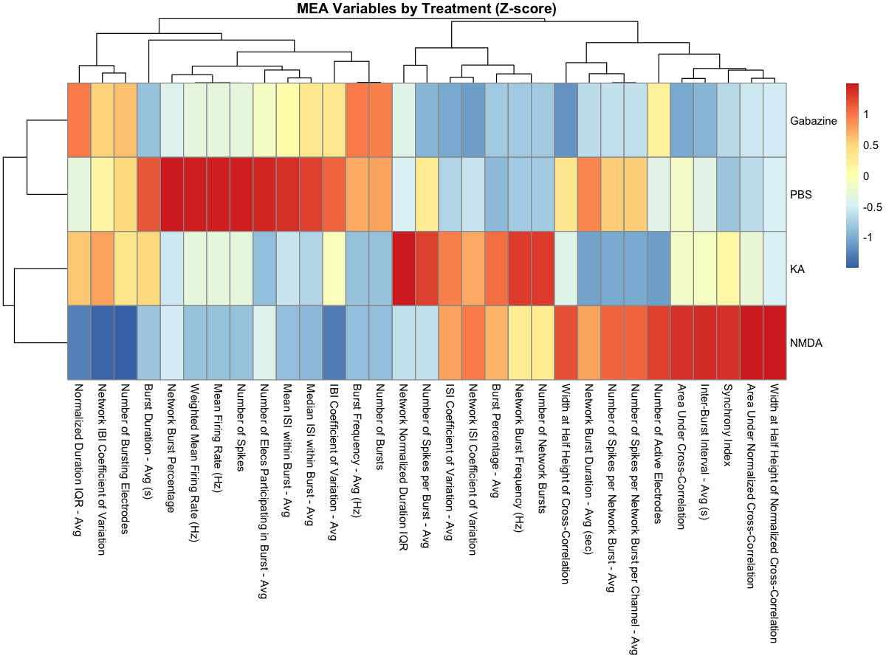

```{r setup, include=FALSE}
knitr::opts_chunk$set(echo=TRUE, eval=FALSE, warning=FALSE, message=FALSE)
```

# Overview

NOVA is an R package for analysing **Multi-Electrode Array (MEA)** recordings.
It handles the full pipeline from raw Axion Biosystems CSVs to publication-ready figures:

1. **Discover** -- scan a folder, report experiments / timepoints / treatments
2. **Process** -- load CSVs, assign metadata, optionally normalise to baseline
3. **Analyse** -- PCA, activity trajectories, heatmaps
4. **Plot** -- flexible per-metric bar/box/violin plots, heatmap filtering

---

# Installation

```{r, eval=FALSE}
# From local source (development version)
devtools::install("path/to/NOVA")

library(NOVA)
```

---

# Quickstart (no coding required)

For users who just want figures: open `Example/nova_quickstart.R`, set `DATA_DIR`
to your data folder, and run the whole script. That's it.

```
DATA_DIR <- "~/MyMEAExperiments/MEA_NeuronalAgonists"
```

Everything else is automatic: baseline detection, normalization, PCA, trajectories,
heatmaps -- all figures saved to `DATA_DIR/nova_output/`.

---

## Getting Started

### Option A — Install from GitHub (recommended for latest version)

```{r install-github, eval=FALSE}
# Install devtools if needed
if (!requireNamespace("devtools", quietly = TRUE)) install.packages("devtools")

# Install NOVA from GitHub
devtools::install_github("atudoras/nova")
```

Once installed, load the package and point to your data folder:

```{r load-pkg, eval=FALSE}
library(NOVA)

# Option 1 — use your own MEA export folder
DATA_DIR <- "/path/to/your/MEA/exports"

# Option 2 — use the bundled demo data (no download needed)
DATA_DIR <- system.file("extdata", package = "NOVA")
# If that returns "", download the Example folder from GitHub:
# https://github.com/atudoras/nova/tree/main/Example
# and set DATA_DIR <- "/path/where/you/saved/Example"
```

### Option B — Install from CRAN (coming soon)

```{r install-cran, eval=FALSE}
install.packages("NOVA")
```

> **Tip:** After `devtools::install_github()` the package is your official,
> working copy — identical to running it from source. Re-install any time
> with the same command to get the latest version.

---

# Step-by-step workflow

## 1. Discover your data

```{r}
library(NOVA)

discovery <- discover_mea_structure(
  main_dir = "~/MyMEAExperiments/MEA_NeuronalAgonists"
)
```

**What you get back:**

```
=== DISCOVERING MEA DATA STRUCTURE ===
Found 2 experiment(s): MEA022b, MEA022c
Timepoints: baseline, 30min, 1h, 2h, 4h, 24h, 48h
Treatments: PBS, Gabazine, KA, NMDA
Genotypes:  Mavs fl/fl, Mavs ko
Variables:  22 MEA metrics (Mean Firing Rate, Burst Rate, ...)
```

Use `discovery$potential_baselines` to see which timepoint NOVA suggests for
normalisation.

---

## 2. Process your data

```{r}
processed <- process_mea_flexible(
  main_dir           = DATA_DIR,
  grouping_variables = c("Treatment", "Genotype"),
  timepoints_order   = discovery$all_timepoints,
  baseline_timepoint = "baseline"     # or NULL for developmental experiments
)
```

> **No baseline?** Set `baseline_timepoint = NULL`. Heatmaps will automatically
> use raw values rather than fold-change.

---

## 3. PCA

```{r}
pca_results <- pca_analysis_enhanced(
  processed$normalized_data,
  grouping_variables = c("Treatment", "Genotype")
)
```

### PCA scatter -- Treatment colour, Genotype shape

```{r, echo=FALSE, eval=TRUE}

```

*PC1 explains 40.3 % of variance, PC2 explains 25.3 % (224 samples from
MEA022b + MEA022c combined).*

### Elbow plot -- how many PCs to retain?

```{r, echo=FALSE, eval=TRUE}

```

---

## 4. Trajectories

```{r}
trajectories <- create_mea_trajectories(
  processed$normalized_data,
  grouping_cols = c("Treatment", "Genotype")
)
```

### Combined average trajectory

```{r, echo=FALSE, eval=TRUE}

```

**Split by a different column:** simply change `grouping_cols`:

```{r}
# Split only by Treatment (ignoring Genotype)
traj_by_tx <- create_mea_trajectories(
  processed$normalized_data,
  grouping_cols = "Treatment"
)
```

---

## 5. Heatmaps

```{r}
heatmaps <- create_mea_heatmaps_enhanced(
  processing_result = processed
)
```

### MEA Variables by Treatment (Z-score)

```{r, echo=FALSE, eval=TRUE}

```

### Filter to a subset

```{r}
# Only KA and PBS, only baseline and 2h
create_mea_heatmaps_enhanced(
  processing_result  = processed,
  filter_treatments  = c("PBS", "KA"),
  filter_timepoints  = c("baseline", "2h")
)
```

### Split by genotype (one heatmap per genotype)

```{r}
create_mea_heatmaps_enhanced(
  processing_result = processed,
  split_by          = "Genotype"
)
# Returns: list(WT = <heatmap>, KO = <heatmap>)
```

### Raw data (no baseline)

```{r}
# For developmental experiments without a baseline timepoint
create_mea_heatmaps_enhanced(
  processing_result = processed,
  use_raw           = TRUE
)
```

---

## 6. Per-metric bar/box plots

```{r}
# Bar plot: Mean Firing Rate by Treatment over time
plot_mea_metric(
  processed$normalized_data,
  metric   = "Mean Firing Rate (Hz)",
  x_var    = "Timepoint",
  group_by = "Treatment"
)
```

```{r}
# Violin split by Genotype, only PBS and KA
plot_mea_metric(
  processed$normalized_data,
  metric            = "Burst Rate (Hz)",
  plot_type         = "violin",
  facet_by          = "Genotype",
  filter_treatments = c("PBS","KA")
)
```

---

# Customising figures

All plot functions accept `colors` (named vector), `title`, `x_var`, and the
filter arguments. The `02_plot.R` workflow script adds a `TUNE` block at the
top where you set sizes, colors, and filters once and they propagate to every
figure automatically.

---

# Common issues

| Problem | Solution |
|---------|----------|
| "File has insufficient rows" | Check that your CSV has >= 124 rows. NOVA now detects the metadata rows by label ("Treatment"), so a single extra blank row no longer breaks parsing. |
| Heatmap errors on developmental data | Pass `use_raw = TRUE` or `baseline_timepoint = NULL`. |
| Wrong treatments shown | Pass `filter_treatments = c("PBS","KA")` to any plot function. |

---

# Function reference

| Function | What it does |
|----------|--------------|
| `discover_mea_structure()` | Scan folder, report experiments and variables |
| `process_mea_flexible()` | Load CSVs, normalise, return long-format data |
| `pca_analysis_enhanced()` | PCA with scatter, elbow, loading plots |
| `create_mea_trajectories()` | PCA trajectory over time by group |
| `create_mea_heatmaps_enhanced()` | Enhanced pheatmap with filter/split/raw support |
| `plot_mea_metric()` | Bar/box/violin/line for one metric |
| `analyze_pca_variable_importance_general()` | Variable contribution to PCs |
