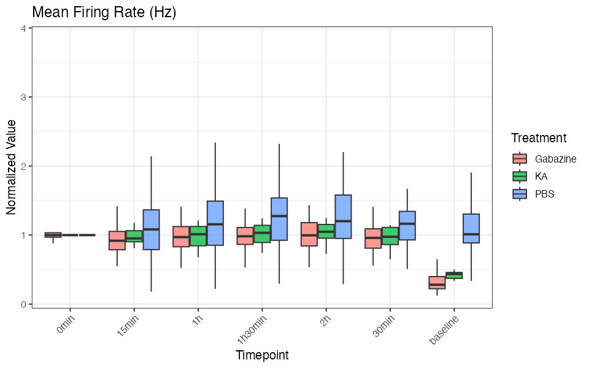

```{r setup, include=FALSE}
knitr::opts_chunk$set(echo = TRUE, eval = FALSE, warning = FALSE, message = FALSE)
```

---

# Overview

NOVA is an R package for analyzing **Multi-Electrode Array (MEA)** recordings. It covers the full pipeline from raw Axion Biosystems CSV exports to publication-ready figures:

1. **Discover** — scan a folder, report experiments, timepoints, and treatments
2. **Process** — load CSVs, assign metadata, normalize to baseline
3. **Analyze** — PCA, trajectory analysis, heatmaps
4. **Plot** — per-metric bar, box, violin, or line plots with flexible grouping

---

# Installation

```{r}
# Install from GitHub (recommended)
if (!requireNamespace("devtools", quietly = TRUE)) install.packages("devtools")
devtools::install_github("atudoras/nova")

# Or from CRAN (coming soon)
install.packages("NOVA")
```

Once installed:

```{r}
library(NOVA)
DATA_DIR <- "/path/to/your/MEA/exports"
```

---

# Quickstart (no coding required)

Open `Example/nova_quickstart.R`. Set `DATA_DIR` to your MEA data folder and run the whole script — that's it.

```{r}
DATA_DIR <- "~/MyMEAExperiments"
```

NOVA will automatically detect the folder structure, normalize to baseline, run PCA and trajectory analysis, and save all figures to `DATA_DIR/nova_output/`.

---

# Step-by-step Workflow

## 1. Discover your data

```{r}
discovery <- discover_mea_structure(main_dir = DATA_DIR)
```

**Example output:**

```
=== DISCOVERING MEA DATA STRUCTURE ===
Found 2 experiment(s): MEA012, MEA013
Timepoints: baseline, 0min, 15min, 30min, 1h, 1h30, 2h
Treatments: PBS, KA, NMDA, Gabazine
Variables:  29 MEA metrics (Mean Firing Rate, Burst Rate, ...)
```

Use `discovery$potential_baselines` to confirm which timepoint NOVA recommends for normalization.

---

## 2. Process your data

```{r}
processed <- process_mea_flexible(
  main_dir           = DATA_DIR,
  grouping_variables = c("Experiment", "Treatment", "Well"),
  selected_timepoints = c("baseline", "0min", "15min", "30min", "1h", "1h30", "2h"),
  baseline_timepoint = "baseline"
)
```

> **No baseline?** Set `baseline_timepoint = NULL`. Heatmaps will automatically use raw values rather than fold-change.

The result is a list with `processed$processed_data` (long-format data frame) ready for all downstream functions.

---

## 3. PCA

```{r}
pca_results <- pca_analysis_enhanced(processing_result = processed)
```

### PCA scatter — color by Treatment

```{r}
pca_plots_enhanced(
  pca_output     = pca_results,
  color_variable = "Treatment",
  shape_variable = NULL
)
```

```{r, echo=FALSE, eval=TRUE}
knitr::include_graphics("figures/pca_color_only.png")
```

### PCA scatter with 95% confidence ellipses

```{r}
pca_plots_enhanced(
  pca_output      = pca_results,
  color_variable  = "Treatment",
  add_ellipses    = TRUE
)
```

```{r, echo=FALSE, eval=TRUE}
knitr::include_graphics("figures/pca_color_with_ellipses.png")
```

### Elbow plot — how many PCs to retain?

```{r}
print(pca_results$elbow_plot)
```

```{r, echo=FALSE, eval=TRUE}
knitr::include_graphics("figures/pca_elbow.png")
```

---

## 4. PCA Trajectories

Track how neural activity evolves over time for each treatment group.

```{r}
trajectories <- plot_pca_trajectories_general(
  pca_results,
  timepoint_order     = c("baseline", "0min", "15min", "30min", "1h", "1h30", "2h"),
  trajectory_grouping = c("Treatment")
)
```

```{r, echo=FALSE, eval=TRUE}
knitr::include_graphics("figures/readme_trajectory.png")
```

Each group traces a distinct path through PCA space. The open circle marks the start (baseline) and the filled circle marks the end of the recording.

---

## 5. Heatmaps

### All treatments (Z-score, clustered)

```{r}
heatmaps <- create_mea_heatmaps_enhanced(
  processing_result = processed,
  grouping_columns  = c("Treatment")
)
```

```{r, echo=FALSE, eval=TRUE}
knitr::include_graphics("figures/heatmap_treatment.png")
```

### Filter to a subset of treatments

```{r}
create_mea_heatmaps_enhanced(
  processing_result = processed,
  grouping_columns  = c("Treatment"),
  filter_treatments = c("PBS", "KA")
)
```

### Raw data (no normalization)

```{r}
# For developmental experiments without a baseline timepoint
create_mea_heatmaps_enhanced(
  processing_result = processed,
  use_raw           = TRUE
)
```

---

## 6. Per-metric plots

### Bar plot — Mean Firing Rate over time

```{r}
plot_mea_metric(
  data      = processed$processed_data,
  metric    = "MeanFiringRate",
  plot_type = "bar",
  facet_by  = "Timepoint"
)
```

```{r, echo=FALSE, eval=TRUE}
knitr::include_graphics("figures/metric_bar_firing_rate.png")
```

### Box plot

```{r}
plot_mea_metric(
  data      = processed$processed_data,
  metric    = "MeanFiringRate",
  plot_type = "box",
  facet_by  = "Timepoint"
)
```

```{r, echo=FALSE, eval=TRUE}

```

### Filter to specific treatments

```{r}
plot_mea_metric(
  data              = processed$processed_data,
  metric            = "MeanFiringRate",
  plot_type         = "violin",
  facet_by          = "Timepoint",
  filter_treatments = c("PBS", "KA")
)
```

---

# Customizing Figures

All plot functions share a common set of optional arguments:

| Argument | Description |
|---|---|
| `color_variable` | Column to map to color |
| `shape_variable` | Column to map to point shape |
| `filter_treatments` | Character vector of treatments to include |
| `add_ellipses` | `TRUE` to draw 95% confidence ellipses on PCA plots |
| `use_raw` | `TRUE` to skip baseline normalization in heatmaps |
| `plot_type` | `"bar"`, `"box"`, `"violin"`, or `"line"` |
| `facet_by` | Column to use for faceting |

The `02_plot.R` workflow script in `Example/` provides a `TUNE` block at the top where you set colors, sizes, and filters once and they propagate to all figures automatically.

---

# Data Format

NOVA expects the standard Axion BioSystems directory layout:

- **Top-level folder**: one directory per MEA plate, named `MEA` followed by digits (e.g., `MEA012`, `MEA013`)
- **CSV files**: one file per timepoint, named `<plate>_<timepoint>.csv` (e.g., `MEA012_baseline.csv`, `MEA012_1h.csv`)
- **Metadata rows**: well identifiers and treatment labels are located starting from the row containing `"Treatment"` — NOVA finds this automatically with `find_mea_metadata_row()`
- **Timepoint names**: any string after the underscore is accepted (`baseline`, `1h`, `DIV7`, etc.)

```
MEA_data/
├── MEA012/
│   ├── MEA012_baseline.csv
│   ├── MEA012_1h.csv
│   └── MEA012_2h.csv
├── MEA013/
│   ├── MEA013_baseline.csv
│   └── MEA013_1h.csv
```

---

# Function Reference

| Function | Description | Key Parameters |
|---|---|---|
| `discover_mea_structure()` | Scan directory, report experiments and timepoints | `main_dir`, `verbose` |
| `process_mea_flexible()` | Load and merge CSVs, normalize to baseline | `main_dir`, `selected_timepoints`, `grouping_variables`, `baseline_timepoint` |
| `pca_analysis_enhanced()` | Run PCA, return scores, loadings, and variance | `processing_result`, `scale`, `center` |
| `pca_plots_enhanced()` | PCA scatter, ellipses, loadings, variance plots | `pca_output`, `color_variable`, `shape_variable`, `add_ellipses` |
| `plot_pca_trajectories_general()` | Mean PCA trajectories across timepoints | `pca_output`, `timepoint_order`, `trajectory_grouping` |
| `create_mea_heatmaps_enhanced()` | Clustered heatmap of all MEA metrics | `processing_result`, `grouping_columns`, `filter_treatments`, `use_raw` |
| `plot_mea_metric()` | Bar, box, violin, or line plot for one metric | `data`, `metric`, `plot_type`, `facet_by`, `filter_treatments`, `error_type` |

---

# Troubleshooting

| Problem | Solution |
|---|---|
| "File has insufficient rows" | NOVA detects metadata rows by label (`"Treatment"`), so export format variations are handled automatically. Check that your CSV is a valid Axion export. |
| Heatmap errors on developmental data | Pass `use_raw = TRUE` or `baseline_timepoint = NULL`. |
| Wrong treatments shown | Pass `filter_treatments = c("PBS", "KA")` to any plot function. |
| PCA returns no variance | Ensure `scale = TRUE` (default) and that your data has more wells than metrics. |

---

# Citation

If you use NOVA in published research, please cite:

> Escoubas CC, Guney E, Tudoras Miravet À, Magee N, Phua R, Ruggero D, Molofsky AV, Weiss WA (2025). *NOVA: a novel R-package enabling multi-parameter analysis and visualization of neural activity in MEA recordings.* bioRxiv. https://doi.org/10.1101/2025.10.01.679841

---

*Questions or bug reports: [GitHub Issues](https://github.com/atudoras/nova/issues) or alex.tudorasmiravet@ucsf.edu*
