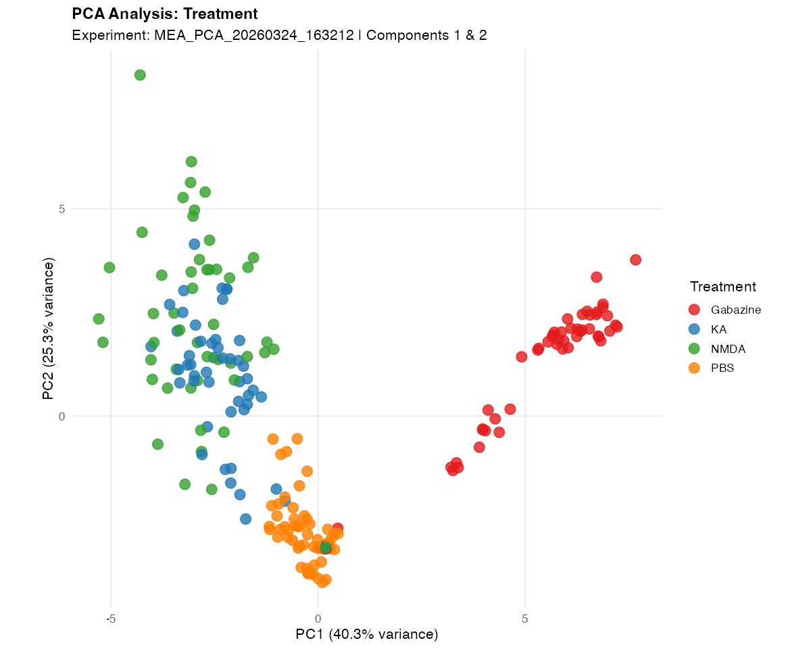
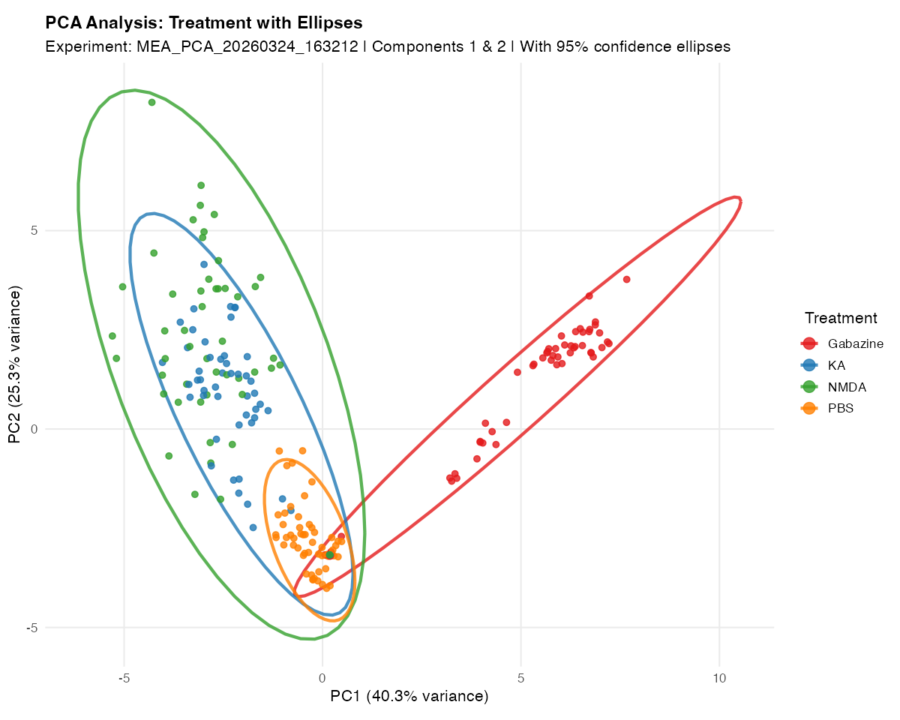
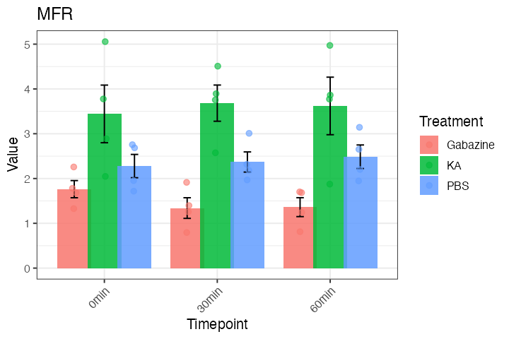
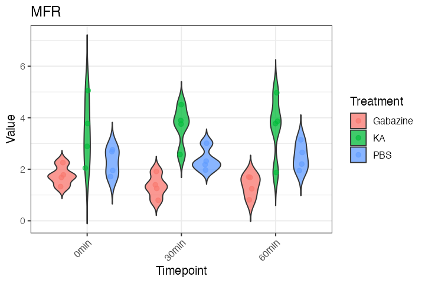
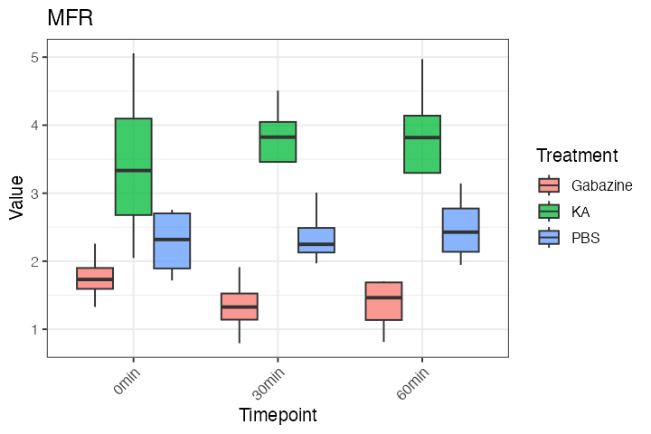

# NOVA User Guide

**Neural Output Visualization and Analysis**

> A complete walkthrough from raw MEA CSV files to publication-ready figures.

---

## Contents

1. [Installation](#installation)
2. [Quickstart](#quickstart)
3. [Step-by-step Workflow](#step-by-step-workflow)
   - [Discover](#1-discover-your-data)
   - [Process](#2-process-your-data)
   - [PCA](#3-pca)
   - [Trajectories](#4-pca-trajectories)
   - [Heatmaps](#5-heatmaps)
   - [Per-metric plots](#6-per-metric-plots)
4. [Customizing Figures](#customizing-figures)
5. [Data Format](#data-format)
6. [Function Reference](#function-reference)
7. [Troubleshooting](#troubleshooting)
8. [Citation](#citation)

---

## Installation

```r
# Install from GitHub (recommended)
if (!requireNamespace("devtools", quietly = TRUE)) install.packages("devtools")
devtools::install_github("atudoras/nova")
```

```r
library(NOVA)
DATA_DIR <- "/path/to/your/MEA/exports"
```

---

## Quickstart

Open `Example/nova_quickstart.R`, set `DATA_DIR` to your data folder, and run. No other configuration needed — NOVA auto-detects experiments, normalizes to baseline, runs PCA and trajectories, and saves all figures to `DATA_DIR/nova_output/`.

---

## Step-by-step Workflow

### 1. Discover your data

```r
discovery <- discover_mea_structure(main_dir = DATA_DIR)
```

```
=== DISCOVERING MEA DATA STRUCTURE ===
Found 2 experiment(s): MEA012, MEA013
Timepoints: baseline, 0min, 15min, 30min, 1h, 1h30, 2h
Treatments: PBS, KA, NMDA, Gabazine
Variables:  29 MEA metrics
```

Use `discovery$potential_baselines` to confirm which timepoint NOVA recommends for normalization.

---

### 2. Process your data

```r
processed <- process_mea_flexible(
  main_dir            = DATA_DIR,
  grouping_variables  = c("Experiment", "Treatment", "Well"),
  selected_timepoints = c("baseline", "0min", "15min", "30min", "1h", "1h30", "2h"),
  baseline_timepoint  = "baseline"
)
```

> **No baseline?** Set `baseline_timepoint = NULL`. Heatmaps will use raw values automatically.

---

### 3. PCA

```r
pca_results <- pca_analysis_enhanced(processing_result = processed)
```

**Scatter plot — colored by Treatment**

```r
pca_plots_enhanced(
  pca_output     = pca_results,
  color_variable = "Treatment"
)
```



<br>

**With 95% confidence ellipses**

```r
pca_plots_enhanced(
  pca_output     = pca_results,
  color_variable = "Treatment",
  add_ellipses   = TRUE
)
```



<br>

**Elbow plot — variance explained per PC**

```r
print(pca_results$elbow_plot)
```


---

### 4. PCA Trajectories

```r
plot_pca_trajectories_general(
  pca_results,
  timepoint_order     = c("baseline", "0min", "15min", "30min", "1h", "1h30", "2h"),
  trajectory_grouping = "Treatment"
)
```


Each group traces a distinct path through PCA space. Open circle = baseline (start), filled circle = last timepoint (end).

---

### 5. Heatmaps

**All treatments — Z-score, hierarchically clustered**

```r
create_mea_heatmaps_enhanced(
  processing_result = processed,
  grouping_columns  = "Treatment"
)
```


<br>

**Filter to a subset of treatments**

```r
create_mea_heatmaps_enhanced(
  processing_result = processed,
  grouping_columns  = "Treatment",
  filter_treatments = c("PBS", "KA")
)
```

**Raw (un-normalized) data**

```r
create_mea_heatmaps_enhanced(
  processing_result = processed,
  use_raw           = TRUE
)
```

---

### 6. Per-metric plots

> **Note:** Because values are normalized to baseline, plotting the baseline timepoint will always show a flat bar at 1. It is usually cleaner to filter it out and focus on post-treatment timepoints.

**Bar plot**

```r
plot_mea_metric(
  data              = processed$processed_data,
  metric            = "MeanFiringRate",
  plot_type         = "bar",
  facet_by          = "Timepoint",
  filter_treatments = c("Gabazine", "KA", "PBS"),
  filter_timepoints = c("0min", "30min", "1h", "2h")   # exclude baseline
)
```



<br>

**Violin plot**

```r
plot_mea_metric(
  data              = processed$processed_data,
  metric            = "MeanFiringRate",
  plot_type         = "violin",
  facet_by          = "Timepoint",
  filter_timepoints = c("0min", "30min", "1h", "2h")
)
```



<br>

**Box plot**

```r
plot_mea_metric(
  data              = processed$processed_data,
  metric            = "MeanFiringRate",
  plot_type         = "box",
  facet_by          = "Timepoint",
  filter_timepoints = c("0min", "30min", "1h", "2h")
)
```



---

## Customizing Figures

| Argument | Description |
|---|---|
| `color_variable` | Column to map to point/line color |
| `shape_variable` | Column to map to point shape |
| `filter_treatments` | Subset of treatments to include |
| `filter_timepoints` | Subset of timepoints to include |
| `add_ellipses` | `TRUE` to draw 95% confidence ellipses on PCA plots |
| `use_raw` | `TRUE` to skip normalization in heatmaps |
| `plot_type` | `"bar"`, `"box"`, `"violin"`, or `"line"` |
| `facet_by` | Column to facet the plot by |
| `error_type` | `"sem"` (default) or `"sd"` |

The `Example/02_plot.R` script provides a `TUNE` block at the top — set colors, sizes, and filters once and they apply to every figure automatically.

---

## Data Format

NOVA expects the standard Axion BioSystems directory layout:

```
MEA_data/
├── MEA012/
│   ├── MEA012_baseline.csv
│   ├── MEA012_1h.csv
│   └── MEA012_2h.csv
└── MEA013/
    ├── MEA013_baseline.csv
    └── MEA013_1h.csv
```

- **Folder names:** `MEA` followed by digits (e.g., `MEA012`, `MEA016a`)
- **File names:** `<plate>_<timepoint>.csv`
- **Metadata:** NOVA finds the metadata rows automatically by searching for the `"Treatment"` label — no fixed row number needed
- **Timepoint names:** any string after the underscore is accepted (`baseline`, `1h`, `DIV7`, etc.)

---

## Function Reference

| Function | Description | Key Parameters |
|---|---|---|
| `discover_mea_structure()` | Scan directory, report experiments and timepoints | `main_dir`, `verbose` |
| `process_mea_flexible()` | Load CSVs, merge, and normalize to baseline | `main_dir`, `selected_timepoints`, `grouping_variables`, `baseline_timepoint` |
| `pca_analysis_enhanced()` | Run PCA; return scores, loadings, variance | `processing_result`, `scale`, `center` |
| `pca_plots_enhanced()` | PCA scatter, ellipses, loadings, variance plots | `pca_output`, `color_variable`, `shape_variable`, `add_ellipses` |
| `plot_pca_trajectories_general()` | Mean PCA trajectories across timepoints | `pca_output`, `timepoint_order`, `trajectory_grouping` |
| `create_mea_heatmaps_enhanced()` | Clustered heatmap of all MEA metrics | `processing_result`, `grouping_columns`, `filter_treatments`, `use_raw` |
| `plot_mea_metric()` | Bar, box, violin, or line plot for one metric | `data`, `metric`, `plot_type`, `facet_by`, `filter_treatments`, `filter_timepoints`, `error_type` |

---

## Troubleshooting

| Problem | Solution |
|---|---|
| "File has insufficient rows" | Check your CSV is a valid Axion export. NOVA finds metadata rows by label, so minor format variations are handled automatically. |
| Heatmap errors on developmental data | Use `use_raw = TRUE` or `baseline_timepoint = NULL`. |
| Baseline bar looks flat at 1 | Expected — data is normalized to baseline. Use `filter_timepoints` to exclude it from plots. |
| Wrong treatments shown | Pass `filter_treatments = c("PBS", "KA")` to any plot function. |
| Timepoints out of order | Pass `timepoint_order` explicitly to `plot_pca_trajectories_general()`. |

---

## Citation

If you use NOVA in published research, please cite:

> Escoubas CC, Guney E, Tudoras Miravet À, Magee N, Phua R, Ruggero D, Molofsky AV, Weiss WA (2025). *NOVA: a novel R-package enabling multi-parameter analysis and visualization of neural activity in MEA recordings.* bioRxiv. https://doi.org/10.1101/2025.10.01.679841

---

*Questions or bug reports: [GitHub Issues](https://github.com/atudoras/nova/issues) · alex.tudorasmiravet@ucsf.edu*
